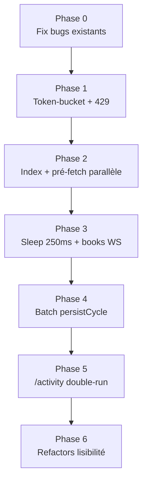

# Audit & plan d'optimisation — Latence, pipelines et débit API

**Date** : 2026-06-20  
**Version** : Polywatch v0.8  
**Objet** : cartographie des pipelines copy-trading, audit pré-implémentation des optimisations latence/process/architecture, et plan d'exécution en 7 phases.  
**Statut global** : **Implémenté** — phases 0 à 6 livrées le 2026-06-20 (voir document d'implémentation lié).

**Documents liés** :
- [2026-06-20_implementation-optimisations-phases-0-6.md](./2026-06-20_implementation-optimisations-phases-0-6.md) — changements réellement appliqués
- [docs/reference/pipeline-copy-trading.md](../reference/pipeline-copy-trading.md) — pipeline copy-trading existant
- [scripts/archive/audits/AUDIT-OPTIMIZATIONS-2026-06-12.md](../../scripts/archive/audits/AUDIT-OPTIMIZATIONS-2026-06-12.md) — audit optimisations antérieur

---

## 1. Contexte — latence actuelle

### 1.1 Détection (MoveDetector)

Polywatch **ne détecte pas** les positions trader via WebSocket CLOB. La détection repose sur :

1. Polling REST adaptatif toutes les **2 s** (`MOVE_DETECTOR_INTERVAL_MS`)
2. `GET /positions` paginé (500/page, max 20 pages, **250 ms** entre pages)
3. Diff snapshot DB vs entrant (`PollCycleService.computeTransitions`)

| Composant | Latence typique |
|-----------|-----------------|
| Attente prochain cycle poll | 0–2 000 ms (moy. ~1 s) |
| Fetch API + pagination | 100 ms–7 s+ |
| Diff + persist DB | 10–50 ms |
| **Total détection** | **~1–2,5 s** (jusqu'à ~7 s+ gros portefeuilles) |

### 1.2 Traitement (CopyProcessor → Executor)

| Étape | Latence typique |
|-------|-----------------|
| Dequeue Redis | Quasi-immédiat (timeout BRPOPLPUSH 5 s = idle seulement) |
| CopyProcessor + entry pipeline (VWAP x3) | 200–800 ms |
| Executor sim | ~0 ms |
| Executor real | 100–2 000 ms |
| **Total OPENED → position open** | **~1,5–5,5 s** |

### 1.3 Surveillance stratégie (positions déjà ouvertes)

- Boucle **100 ms** + réaction immédiate sur update book WS
- Throttle close-eval : **50 ms**/position
- Kill switch : **10 s**

---

## 2. Verdict post-audit

- Le plan d'optimisation est **faisable** ; les gains sont réels et mesurables.
- **2 bugs fantômes existent déjà** dans le code (indépendants du plan).
- **3 optimisations** sont à risque élevé/moyen sans garde-fous (`/activity`, pré-souscription books, suppression sleep 250 ms).
- **1 optimisation retirée** : parallélisation sim+real (race limites risque).
- Le risque de surcharge API Polymarket **existe déjà** au-delà de ~30 traders surveillés (150 req/10 s sur `/positions`).

---

## 3. Bugs fantômes existants (Phase 0 — priorité absolue)

### 3.1 OPENED/INCREASED perdus après `config-changed`

**Fichiers** : `packages/worker/src/index.ts`, `packages/worker/src/processors/move-detector.ts`, `packages/core/src/services/poll-cycle.service.ts`

**Problème** : sur `config-changed`, tous les traders repassent en `reconcile()` (`reconcileOnly=true`). Les OPENED/INCREASED ne sont pas émis, mais le snapshot entrant **est persisté**. Au cycle suivant, la position est déjà en base → **aucune transition, move perdu définitivement**.

**Correction proposée** (une des options) :
- Ne pas appeler `markFirstPollPending` pour tous les traders sur un simple changement config risque/tags.
- Ou : en reconcile, ne pas persister les positions nouvellement apparues (baseline différée).
- Ou : comparer snapshot avant/après reconcile et émettre les OPENED manqués.

### 3.2 Retry copy bloqué après réservation partielle

**Fichiers** : `packages/worker/src/processors/copy-processor.ts`, `packages/worker/src/processors/copy/copy-position-lookup.ts`

**Problème** : si `runCopyEntryPipeline` crée une position `pending` puis échoue avant `markProcessed`, le retry Redis voit `hasActivePosition=true` → skip « Position déjà ouverte » → move marqué processed **sans ordre exécuté**.

**Correction proposée** (une des options) :
- Distinguer `pending` sans ordre en cours vs position réellement ouverte dans `canHandleEntry`.
- Ou : reprendre la réservation existante (même `moveEventId`) au lieu de skip.
- Ou : libérer la réservation avant retry si l'ordre n'a pas été enqueued.

---

## 4. Plan d'exécution en 7 phases

| Phase | Contenu | Effort | Gain | Risque |
|-------|---------|--------|------|--------|
| **0** | Corriger bugs fantômes existants | Moyen | Correctness | — |
| **1** | Token-bucket + gestion 429 worker | Moyen | Évite blackout API 30 s | Faible |
| **2** | Index composites + pré-fetch parallèle | Faible | 50–300 ms/entrée, 5–50 ms/lookup | Nul/Faible |
| **3** | Sleep 250 ms conditionnel + books WS | Moyen | Jusqu'à 4,75 s/poll, 50–200 ms/entrée | Moyen |
| **4** | Batch upsert `persistCycle` | Moyen | 100 ms–1 s+ gros snapshots | Moyen |
| **5** | Détection `/activity` (double-run) | Élevé | Détection sub-seconde | **Élevé** |
| **6** | Refactors axe 3 | Continu | Lisibilité/maintenance | Faible |

---

## 5. Phase 1 — Garde-fou débit API Polymarket (prérequis latence)

### 5.1 Limites Polymarket (fenêtre glissante 10 s)

| Endpoint | Limite |
|----------|--------|
| Data API `/positions` | **150 req / 10 s** (le plus contraint) |
| Data API `/activity` | 1 000 req / 10 s (bucket général) |
| Data API `/trades` | 200 req / 10 s |
| CLOB `/book` | 1 500 req / 10 s |

**Budget actuel** : polling 2 s = 5 cycles/10 s → max **30 requêtes positions/cycle** (traders × pages).

### 5.2 Faiblesses actuelles

- Pas de token-bucket global (`packages/worker/src/polymarket/api-client.ts`)
- Pas de gestion 429 dans le worker (contrairement au frontend `packages/frontend/src/api.ts`)
- Circuit breaker réactif : 5 échecs → OPEN **30 s** → blackout total (`packages/worker/src/polymarket/circuit-breaker.ts`)
- Le sleep 250 ms inter-pages ne protège **pas** le scénario multi-traders parallèle

### 5.3 À implémenter

1. Token-bucket global par endpoint (`/positions`, `/activity`, `/book`), partagé entre tous les pollers.
2. Retry 429 avec `Retry-After` + backoff exponentiel + jitter.
3. Ne **pas** compter les 429 retryables comme échecs du circuit breaker.

---

## 6. Phases 2–3 — Quick wins latence

### 6.1 Index composites (Phase 2, risque nul)

- `copied_positions(watchlist_id, condition_id, asset_id, mode, status)`
- `watchlist(trader_address)`
- `executions(mode, executed_at)`

### 6.2 Paralléliser pré-fetch entry pipeline (Phase 2, risque faible)

**Fichier** : `packages/worker/src/processors/copy/copy-entry-pipeline.ts` (lignes 58–87)

`Promise.all` sur `fetchRealPusdBalance`, `resolveTraderPortfolioValue`, `loadByConditionIds` — puis `resolveEntryBalances` séquentiellement.

Les 3 passes VWAP **ne sont pas** parallélisables (chaque taille dépend de la VWAP précédente).

### 6.3 Supprimer sleep 250 ms inter-pages (Phase 3, risque moyen)

Remplacer le sleep systématique par backoff adaptatif sur 429 uniquement.

**Prérequis** : Phase 1 terminée. **Gain** : jusqu'à 4,75 s/poll/trader multi-pages.

**Risque sans garde-fou** : burst → throttling → circuit breaker OPEN 30 s → silence total sur tous les traders.

### 6.4 Pré-souscrire books des moves entrants (Phase 3, risque élevé sans registre)

**Problème** : `sync-book-subscriptions.ts` reconcile toutes les 10 s avec **uniquement** les positions copiées actives. Un asset souscrit au move sans position copiée est **désabonné et effacé du cache** au prochain sync.

**Prérequis obligatoire** : registre `pendingMoveAssets` (TTL ~30 s) fusionné dans `syncBookSubscriptions`.

**Gain** : 50–200 ms/entrée.

---

## 7. Phase 4 — Optimisations DB

### 7.1 Batch upsert `persistCycle` (risque moyen)

**Fichier** : `packages/core/src/services/poll-cycle.service.ts`

Remplacer N+1 par upsert en masse + requête d'existence unique.

**Garde-fous** :
- Préserver sémantique `snapshotSeq` (incrémenté seulement si `insertedCount > 0`)
- Tests idempotence `hashMoveEventId`
- Mesurer durée transaction SQLite (lock)

### 7.2 Cache watchlist / risk config (risque moyen)

TTL court (5 s) + invalidation Redis `config-changed`. Ne pas cacher le kill switch sans TTL.

---

## 8. Phase 5 — Détection `/activity` (risque élevé)

**Client existant** : `packages/backend/src/polymarket/data-api-client.ts` — **non câblé au worker**.

### 8.1 Pourquoi risque élevé ?

Le mécanisme actuel (`/positions` + diff snapshot) compare des **états** : tout changement de taille est détecté, quelle que soit la cause (trade, split, merge…).

`/activity` reçoit des **événements** à interpréter. Toute erreur d'interprétation produit un move manqué ou un faux move **sans erreur visible** — le pire type de bug en copy-trading.

| Facteur | `/positions` (actuel) | `/activity` (Phase 5) |
|---------|----------------------|----------------------|
| Modèle | État → état (diff) | Événements → inférence |
| Couverture | Tous changements de taille | Dépend du mapping |
| Rattrapage après raté | Oui (prochain poll) | Non sans curseur fiable |
| Idempotence | Éprouvée (`snapshotSeq`) | À reconstruire |
| Risque de silence | Faible (lag 2 s max) | **Élevé** |

### 8.2 Risques identifiés

| Risque | Impact |
|--------|--------|
| SPLIT/MERGE non mappés | Moves manqués (changement taille sans TRADE) |
| Curseur timestamp non persisté | Perte événements au restart |
| Idempotence `hashMoveEventId` + `snapshotSeq` | Doublons ou hashes divergents |
| Double-run activity + positions | Double réservation possible |
| `hasOpenCopiedPosition` = `open` seulement | DECREASED/CLOSED filtrés pendant entrée `pending` |

### 8.3 Garde-fous obligatoires

1. Conserver `/positions` en réconciliation périodique (60 s) — **non optionnel**
2. Curseur `lastActivityTimestamp` par trader en DB
3. Gérer SPLIT/MERGE ou documenter exclusion explicite
4. Phase **double-run** avec métriques de divergence avant bascule
5. Phase 0 terminée (bug reconcile config-changed)
6. Tests : restart worker, gap timestamp, config-changed, trader multi-pages

**Gain** : détection sub-seconde + soulage bucket `/positions` (150 → 1 000 req/10 s).

---

## 9. Phase 6 — Refactors séparation des responsabilités

| Refactor | Fichier(s) | Note |
|----------|-----------|------|
| Découper `evaluatePosition` | `packages/worker/src/processors/strategy-processing.ts` | Branches liquide/illiquide |
| Slippage guard partagé sim/real | `packages/worker/src/processors/executor.ts`, `packages/worker/src/clob/real-executor.ts` | Tests executor obligatoires |
| Coordinateur refresh + constantes | `packages/worker/src/index.ts`, `packages/worker/src/constants.ts` | Déduper config-changed / backend-ready |
| Consolider lookups position | `packages/core/src/move-events/relevance.ts`, `packages/worker/src/processors/copy/copy-position-lookup.ts` | → `CopiedPositionService` |
| `buildStaleTick` → `computePnlSnapshot` | `packages/worker/src/processors/strategy/position-evaluator.ts` | Dédup formules PnL |

---

## 10. Retiré du plan

| Optimisation | Raison |
|--------------|--------|
| Paralléliser sim+real | Race sur `max_open_positions` / `max_exposure` (cache 10 s) |
| Baisser intervalle poll <2 s | Proscrit sans token-bucket global |
| Multi-consumers move-events | Reporté — nécessite idempotence CopyProcessor |
| Timeout BRPOPLPUSH 5s→1s | Impact idle seulement, gain négligeable |

---

## 11. Tableau risque consolidé

| Optimisation | Phase | Bug fantôme ? | Prérequis |
|--------------|-------|---------------|-----------|
| Fix reconcile config-changed | 0 | Corrige bug existant | — |
| Fix retry copy | 0 | Corrige bug existant | — |
| Token-bucket + 429 | 1 | Non (réduit blackouts) | — |
| Index composites | 2 | Non | — |
| Pré-fetch parallèle | 2 | Non | — |
| Supprimer sleep 250 ms | 3 | Oui (blackout 30 s) | Phase 1 |
| Pré-souscrire books | 3 | Oui (désabonnement 10 s) | Registre pendingMoveAssets |
| Batch persistCycle | 4 | Possible (seq/idempotence) | Tests intégration |
| Cache watchlist/risk | 4 | Oui (kill switch stale) | TTL + invalidation |
| `/activity` | 5 | Oui (moves manqués/doublons) | Double-run + Phase 0 |
| Refactors axe 3 | 6 | Non si tests OK | Tests executor |

---

## 12. Gains latence attendus

| Étape | Aujourd'hui | Après phases 0–3 | Après phase 5 |
|-------|-------------|------------------|---------------|
| Détection | ~1–2,5 s (+ pagination) | ~1–2 s | **<1 s** |
| Décision copy | ~0,2–1 s | ~0,1–0,7 s | idem |
| Exécution sim | ~0 ms | idem | idem |
| Exécution real | ~0,1–2 s | idem | idem |
| **Total OPENED → position open** | **~1,5–5,5 s** | **~1,2–4 s** | **~0,8–3 s** |

---

## 13. Fichiers clés

| Rôle | Fichier |
|------|---------|
| Polling détection | `packages/worker/src/processors/move-detector.ts` |
| Diff snapshot | `packages/core/src/services/poll-cycle.service.ts` |
| API Data fetch | `packages/worker/src/polymarket/api-client.ts` |
| Décision copy | `packages/worker/src/processors/copy-processor.ts` |
| Pipeline entrée | `packages/worker/src/processors/copy/copy-entry-pipeline.ts` |
| Sync books WS | `packages/worker/src/polymarket/sync-book-subscriptions.ts` |
| Constantes timing | `packages/worker/src/constants.ts` |
| Orchestration | `packages/worker/src/index.ts` |
| Idempotence moves | `packages/core/src/idempotence/hash.ts` |
| Circuit breaker | `packages/worker/src/polymarket/circuit-breaker.ts` |
| Doc pipeline | `docs/pipeline-copy-trading.md` |

---

## 14. Checklist d'implémentation

- [x] **Phase 0** — Corriger reconcile config-changed + retry copy bloqué
- [x] **Phase 1** — Token-bucket global + gestion 429 worker
- [x] **Phase 2** — Index composites + pré-fetch parallèle entry pipeline
- [x] **Phase 3** — Sleep 250 ms conditionnel + books WS (registre pendingMoveAssets)
- [x] **Phase 4** — Batch persistCycle + cache watchlist/risk
- [x] **Phase 5** — `/activity` double-run puis bascule
- [x] **Phase 6** — Refactors lisibilité (evaluatePosition, slippage, index.ts)

> Détail des changements appliqués : [2026-06-20_implementation-optimisations-phases-0-6.md](./2026-06-20_implementation-optimisations-phases-0-6.md).
