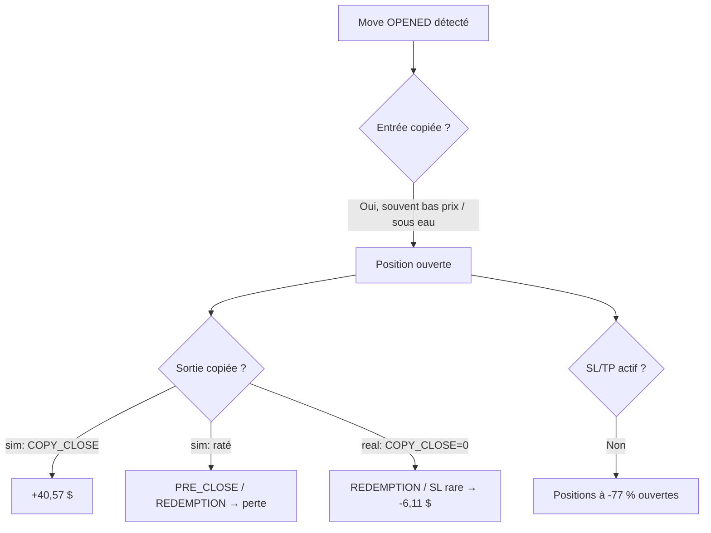

# Audit — Sélection d'entrée, PnL et gestion des positions copy-trading

**Date** : 2026-06-21  
**Version** : Polywatch v0.8  
**Objet** : analyse DB des positions copiées (historique + ouvertes), validation mécanique Polymarket, test de l'hypothèse latence/slippage, et plan de correction orienté PnL.  
**Statut global** : **Diagnostic** — aucune correction appliquée ; recommandations priorisées ci-dessous.

**Documents liés** :
- [2026-06-21_plan-filtre-momentum-entree.md](./2026-06-21_plan-filtre-momentum-entree.md) — plan d'implémentation du filtre momentum (toggle UI)
- [2026-06-20_plan-optimisation-latence-pipelines.md](./2026-06-20_plan-optimisation-latence-pipelines.md) — latence pipelines (phases 0–6 implémentées)
- [scripts/archive/audits/ANALYSE-GAINS-POLYWATCH-v0.6-2026-06-14.md](../../scripts/archive/audits/ANALYSE-GAINS-POLYWATCH-v0.6-2026-06-14.md) — audit gains antérieur
- [docs/reference/pipeline-copy-trading.md](../reference/pipeline-copy-trading.md) — pipeline copy-trading

**Source des métriques** : PostgreSQL `polywatch` (conteneur `polywatch-v07-postgres-1`), snapshot **2026-06-21**.  
**Limite méthodologique** : échantillon modeste (104 closes sim, 16 closes real) → conclusions **directionnelles**, pas statistiquement définitives.

---

## 1. Synthèse exécutive

Le bot copy-trade des mouvements de traders Polymarket. Sur l'historique actuel, **sim et real sont en PnL réalisé négatif** malgré un win rate proche de 50 % en sim. L'analyse montre que le problème n'est **pas** la latence pure (médiane ~3 s) ni un « coût de slippage » classique, mais une **sélection d'entrée défavorable** combinée à une **incapacité à capturer les sorties gagnantes en réel**.

| Rang | Cause | Sévérité | Preuve |
|------|-------|----------|--------|
| 1 | **Sélection d'entrée négative** (moves copiés sous-performent la probabilité implicite) | 🔴 Critique | Win rate REDEMPTION < probabilité implicite dans tous les buckets |
| 2 | **Non-copie des sorties en réel** (0 `COPY_CLOSE` sur 16 closes) | 🔴 Critique | Seule source de profit en sim absente en live |
| 3 | **Stops SL/TP/trailing désactivés** | 🟠 Majeur | `sim_sl_tp_enabled=false`, positions ouvertes à -77 % |
| 4 | **Latence queue 5–30 s** (secondaire) | 🟡 Modéré | PnL +7,88 $ (<5 s) vs -7,62 $ (5–30 s) en sim |
| 5 | **Score de signal sans dimension prix/momentum** | 🟡 Modéré | `signal-scorer.ts` ignore le niveau de prix et le momentum |

**Verdict** : optimiser le PnL passe d'abord par **filtrer ou réduire les mauvaises entrées** et **fiabiliser COPY_CLOSE en réel**, pas par un filtre « favoris uniquement » simpliste (effet variance + collinéarité avec le momentum).

---

## 2. Rappel mécanique Polymarket (cadre d'interprétation)

Sur Polymarket, une position est un **token binaire** :

- Le **prix d'entrée ≈ probabilité implicite** (ex. 0,30 → ~30 % de chances de résoudre à 1 $).
- À la **résolution** : payoff **1 $** (gagnant) ou **0 $** (perdant) → raison de clôture `REDEMPTION`.
- En cours de vie : sortie via **vente dans le carnet** (SL/TP/trailing, `PRE_CLOSE_LOSS`, `COPY_CLOSE`) — contrainte par la **liquidité bid**.
- Sur un marché efficient **sans edge**, l'EV ≈ 0 dans **chaque** bucket de prix (outsiders perdent souvent mais paient gros ; favoris gagnent souvent mais paient peu).

Conséquence pour Polywatch :

| Raison de clôture | Mécanisme | Interprétation PnL |
|-------------------|-----------|-------------------|
| `COPY_CLOSE` | Copie la sortie du trader (vente carnet) | Seule source de profit net en sim |
| `COPY_DECREASE` | Réduction partielle copiée | Neutre / légèrement positif |
| `PRE_CLOSE_LOSS` | Fermeture forcée avant résolution (liquidité / pre-close) | Perte — position non sortie à temps |
| `REDEMPTION` | Tenue jusqu'à résolution | Légitime si gagnant ; perte totale si perdant |
| `SL` / `TP` / trailing | Stratégie interne | Filet de sécurité (si activé + liquidité OK) |

**Erreur d'analyse initiale corrigée** : « REDEMPTION = toujours mauvais » est faux. C'est un dénouement Polymarket normal ; le problème est de **tenir des positions perdantes jusqu'à 0** faute de sortie.

---

## 3. État des positions (snapshot DB)

### 3.1 Volume et PnL global

| Mode | Status | n | PnL réalisé |
|------|--------|---|-------------|
| sim | closed | 104 | **-15,97 $** |
| sim | open | 12 | (unrealized ~ -4,69 $ au snapshot) |
| real | closed | 16 | **-6,11 $** |
| real | cancelled | 37 | 0 |

| Mode | Wins | Losses | Win rate |
|------|------|--------|----------|
| sim | 42 | 62 | 40 % |
| real | 5 | 11 | 31 % |

Espérance négative : tailles de gain/perte comparables, mais **plus de pertes que de gains** et surtout des **gros négatifs non coupés**.

### 3.2 PnL par raison de clôture

| Mode | Raison | n | PnL |
|------|--------|---|-----|
| sim | **COPY_CLOSE** | 40 | **+40,57 $** |
| sim | COPY_DECREASE | 2 | +0,54 $ |
| sim | PRE_CLOSE_LOSS | 37 | **-29,49 $** |
| sim | REDEMPTION | 25 | **-27,58 $** |
| real | REDEMPTION | 14 | -5,22 $ |
| real | SL | 1 | -0,66 $ |
| real | MANUAL | 1 | -0,23 $ |
| real | **COPY_CLOSE** | **0** | **0 $** |

**Signal clé** : en sim, **100 % du profit** vient de `COPY_CLOSE`. En réel, **aucune** sortie copiée → le bot ne capture jamais le seul comportement rentable observé.

### 3.3 ROI par bucket de prix d'entrée

| Mode | Prix d'entrée | n | PnL | Basis (BUY) | ROI |
|------|---------------|---|-----|-------------|-----|
| sim | < 0,35 | 23 | -21,21 $ | 40,04 $ | **-53,0 %** |
| sim | 0,35–0,55 | 28 | -12,94 $ | 68,64 $ | -18,9 % |
| sim | ≥ 0,55 | 53 | **+18,18 $** | 109,50 $ | **+16,6 %** |
| real | < 0,35 | 4 | -4,74 $ | 4,50 $ | -105,3 % |
| real | 0,35–0,55 | 9 | -1,56 $ | 8,50 $ | -18,3 % |
| real | ≥ 0,55 | 3 | +0,18 $ | 3,50 $ | +5,3 % |

⚠️ **Nuancer** : sur un marché efficient sans edge, le ROI par bucket devrait tendre vers 0. L'écart massif peut refléter **variance + petit n** (12 outsiders REDEMPTION à 0 % win) **et** une vraie **sélection négative**. Les deux coexistent.

### 3.4 Win rate REDEMPTION vs probabilité implicite (sim)

| Bucket | n | Wins | Prix moyen (= prob. implicite) | Win rate réel |
|--------|---|------|--------------------------------|---------------|
| < 0,35 | 12 | 0 | 0,262 (~26 % attendu) | **0 %** |
| 0,35–0,55 | 5 | 1 | 0,443 (~44 % attendu) | 20 % |
| ≥ 0,55 | 8 | 4 | 0,701 (~70 % attendu) | 50 % |

Sous l'hypothèse d'efficience, 0/12 à p≈0,26 a ~2,6 % de probabilité → **sélection d'entrée défavorable** au-delà du simple biais favori/outsider.

---

## 4. Positions ouvertes (sim, n=12)

Exemples au snapshot :

| id | entry_price | unrealized PnL % | liquidity_status | sl/tp sur position |
|----|-------------|------------------|------------------|-------------------|
| 8904 | 0,579 | **-76,9 %** | ok | NULL |
| 8919 | 0,390 | **-63,4 %** | ok | NULL |
| 8848 | 0,140 | -9,7 % | ok | NULL |

Toutes les positions ouvertes ont `liquidity_status='ok'` → les pertes extrêmes ne sont **pas** expliquées par un carnet vide au moment du snapshot ; les **stops sont désactivés au niveau config** (`sim_sl_tp_enabled=false`), donc jamais appliqués aux nouvelles positions.

---

## 5. Configuration actuelle (`risk_config`)

| Paramètre | sim | real | Impact |
|-----------|-----|------|--------|
| `*_sl_tp_enabled` | **false** | **false** | Aucun filet SL/TP/trailing |
| `*_sl_percent` | 90 | 50 | Même si activé, seuils inopérants |
| `*_tp_percent` | 300 | 500 | Idem |
| `*_trailing_enabled` | false | false | Pas de protection des gains |
| `*_min_time_to_close` | 120 s | 120 s | Filtre marchés très courts (récent) |
| `*_signal_score_sizing_enabled` | true | **false** | Pas de scoring en live |
| `exit_slippage_guard_percent` | 50 | 50 | Peut bloquer des sorties si spread large |

---

## 6. Test de l'hypothèse latence et slippage

Jointure `copied_positions` ↔ `move_events` via `move_event_id` :
- `trader_avg_price` : prix moyen du trader sur la position (proxy momentum, **pas** le prix exact au tick du move)
- `detected_at` / `opened_at` : mesure du délai pipeline

### 6.1 Latence détection → ouverture (sim, closes)

| Délai | n | PnL |
|-------|---|-----|
| **< 5 s** | 30 | **+7,88 $** |
| **5–30 s** | 18 | **-7,62 $** |
| ≥ 30 s | 2 | +0,46 $ |

- **Médiane** : ~3 s (la moyenne ~26 s était tirée par un outlier à ~996 s).
- La latence **n'est pas la cause racine** mais la queue **5–30 s** coûte ~15 $ sur 18 trades → levier secondaire réel.

### 6.2 Prix payé vs `trader_avg_price` (OPENED, sim, closes)

| Relation | n | PnL | Interprétation |
|----------|---|-----|----------------|
| Au-dessus du prix moyen trader | 28 | **+6,24 $** | Momentum haussier / favori |
| En dessous | 22 | **-5,53 $** | Rachat d'une position déjà sous l'eau |

**Collinéarité** :

| Relation | Prix d'entrée moyen |
|----------|---------------------|
| Au-dessus trader | 0,658 |
| En dessous trader | 0,420 |

Le « slippage positif » n'est **pas** un coût de copie : c'est un **proxy de momentum**. Filtrer `entryAskVwap >= trader_avgPrice` serait un filtre de **qualité de signal**, pas de latence.

### 6.3 Score de signal actuel

Fichier : `packages/core/src/sizing/signal-scorer.ts`

Dimensions prises en compte : profit factor trader, win rate, spread, time-to-expiry.  
**Absent** : niveau de prix, momentum (`entryAskVwap` vs `trader_avg_price`), liquidité de sortie anticipée.

---

## 7. Causes racines consolidées



### 7.1 Sélection d'entrée négative (cause #1)

Le bot copie des moves dont le **résultat final est inférieur à la probabilité implicite** du marché. Mécanismes probables :

1. **Copie de positions déjà perdantes** (prix courant < prix moyen trader).
2. **Outsiders / bas prix** : variance élevée + résolution défavorable systématique sur l'échantillon.
3. **Pas de filtre momentum** dans le pipeline d'entrée.

### 7.2 Non-copie des sorties en réel (cause #2)

En sim, `COPY_CLOSE` génère +40,57 $. En réel, **0 occurrence** sur 16 closes. Causes à investiguer :

- Latence / échec exécution sortie (`COPY_CLOSE` handler, executor real).
- `exit_slippage_guard_percent` trop strict.
- Liquidité insuffisante au moment de la sortie trader.
- Taille réelle trop petite (1,5 USDC) → ordres rejetés / non exécutables.

Fichiers : `packages/worker/src/processors/copy-processor.ts`, `packages/worker/src/processors/executor.ts`, `packages/worker/src/clob/real-executor.ts`.

### 7.3 Stops désactivés (cause #3)

Sans SL/TP/trailing, une position qui dérive reste ouverte jusqu'à `PRE_CLOSE_LOSS` ou `REDEMPTION`. Sur Polymarket, un SL nécessite un **bid exécutable** — mais ici `liquidity_status='ok'` sur les pires positions → le problème est **config**, pas carnet.

### 7.4 Latence queue 5–30 s (cause #4, secondaire)

Les optimisations latence (phases 0–6) adressent surtout la détection (<2 s) et l'entrée (<5 s total typique). Il reste une **queue lente** (18 trades) où le PnL s'effondre → monitorer `opened_at - detected_at` en métrique Prometheus / dashboard.

---

## 8. Recommandations priorisées

### Phase A — Garde-fous config (effort faible, risque faible)

1. **Activer SL/TP/trailing** sim puis real avec des valeurs opérationnelles (ex. SL 15–25 %, TP 30–50 %, trailing ON) — pas 90/300.
2. **Activer `real_signal_score_sizing_enabled`** pour aligner sim et live.
3. **Revoir `exit_slippage_guard_percent`** (50 % peut empêcher COPY_CLOSE en real).

### Phase B — Filtre d'entrée momentum (effort moyen, impact élevé)

Ajouter dans `packages/worker/src/processors/copy/copy-entry-pipeline.ts` (après VWAP, ~ligne 225) :

| Option | Règle | Effet |
|--------|-------|-------|
| **B1 — Hard skip** | Skip si `entryAskVwap < trader_avg_price` (ou ratio < 1,0) | Élimine les rachats sous l'eau |
| **B2 — Soft sizing** | Réduire taille si `entryAskVwap / trader_avg_price < 1,0` via signal score | Moins agressif |
| **B3 — Prix minimum** | Skip si `entryAskVwap < minEntryPrice` (ex. 0,50) | Réduit variance outsiders ; **ne corrige pas** la sélection seule |

**Prérequis** : backtest SQL sur historique (section 10) avant activation en real.

**Backtest filtre momentum (sim, OPENED closes, snapshot 2026-06-21)** :

| Métrique | Valeur |
|----------|--------|
| Positions conservées (`entry ≥ trader_avg`) | 28 |
| PnL conservé | **+6,24 $** |
| Positions filtrées | 22 |
| PnL évité | **-5,53 $** |
| PnL net historique (50 trades) | +0,71 $ vs -15,97 $ global |

Le filtre n'inverse pas à lui seul le PnL global (PRE_CLOSE/REDEMPTION sur les trades « au-dessus » restent), mais **élimine la totalité des pertes du bucket « below trader »** sur les OPENED.

Intégrer B1/B3 dans `packages/core/src/sizing/signal-scorer.ts` pour cohérence avec le sizing existant.

### Phase C — Fiabiliser COPY_CLOSE en réel (effort élevé, impact critique)

1. Tracer chaque move `CLOSED`/`DECREASED` trader → décision copy → ordre SELL → statut execution.
2. Comparer le taux de COPY_CLOSE sim vs real sur la même watchlist / période.
3. Alerter si un move `CLOSED` trader n'engendre pas de signal SELL en real dans les N secondes.

### Phase D — Métriques PnL continues (effort moyen)

Requêtes SQL (section 10) en cron ou dashboard :

- PnL par `close_reason`, bucket prix, lag d'entrée.
- Win rate REDEMPTION vs probabilité implicite.
- Ratio COPY_CLOSE / REDEMPTION par mode.

### Phase E — Backtest avant prod

Ne pas déployer B1/B3 en real sans :

1. Rejouer le filtre sur ≥ 200 closes sim.
2. Vérifier que le ROI filtré reste positif **et** que le volume de trades reste suffisant.

---

## 9. Tableau risque consolidé

| Action | Effort | Gain PnL attendu | Risque |
|--------|--------|------------------|--------|
| Activer SL/TP réalistes | Faible | Moyen (coupe les -77 %) | SL bloqué si carnet vide en fin de marché |
| Filtre momentum (B1) | Moyen | **Élevé** | Under-trading ; faux négatifs si `trader_avg_price` stale |
| Filtre min prix (B3) seul | Faible | Faible–moyen | Réduit variance, pas la sélection |
| Fiabiliser COPY_CLOSE real | Élevé | **Très élevé** | Régression exécution |
| Réduire queue 5–30 s | Moyen (déjà partiellement fait) | Faible–moyen | Surcharge API si mal calibré |

---

## 10. Requêtes SQL de reproduction

```sql
-- PnL global
SELECT mode, status, COUNT(*) n, ROUND(SUM(realized_pnl)::numeric, 2) pnl
FROM copied_positions
GROUP BY mode, status;

-- PnL par raison de clôture
SELECT mode, close_reason, COUNT(*) n, ROUND(SUM(realized_pnl)::numeric, 2) pnl
FROM copied_positions
WHERE status = 'closed'
GROUP BY mode, close_reason
ORDER BY mode, pnl;

-- ROI par bucket de prix d'entrée
WITH cost AS (
  SELECT copied_position_id, SUM(fill_quantity * fill_price) AS basis
  FROM executions
  WHERE side = 'BUY' AND status IN ('filled', 'partial')
  GROUP BY copied_position_id
)
SELECT p.mode,
  CASE
    WHEN p.entry_price < 0.35 THEN 'low'
    WHEN p.entry_price < 0.55 THEN 'mid'
    ELSE 'high'
  END AS bucket,
  COUNT(*) n,
  ROUND(SUM(p.realized_pnl)::numeric, 2) pnl,
  ROUND((SUM(p.realized_pnl) / NULLIF(SUM(c.basis), 0) * 100)::numeric, 1) roi_pct
FROM copied_positions p
JOIN cost c ON c.copied_position_id = p.id
WHERE p.status = 'closed'
GROUP BY p.mode, bucket;

-- Latence vs PnL
WITH j AS (
  SELECT p.realized_pnl,
         EXTRACT(EPOCH FROM (p.opened_at - m.detected_at)) AS lag_s
  FROM copied_positions p
  JOIN move_events m ON m.id = p.move_event_id
  WHERE p.mode = 'sim' AND p.status = 'closed'
    AND p.opened_at IS NOT NULL
)
SELECT CASE
         WHEN lag_s < 5 THEN '<5s'
         WHEN lag_s < 30 THEN '5-30s'
         ELSE '>=30s'
       END AS lag_bucket,
       COUNT(*) n,
       ROUND(SUM(realized_pnl)::numeric, 2) pnl
FROM j
GROUP BY lag_bucket;

-- Momentum (prix vs trader_avg_price)
WITH j AS (
  SELECT p.realized_pnl,
         (p.entry_price - m.trader_avg_price) / NULLIF(m.trader_avg_price, 0) * 100 AS slip_pct
  FROM copied_positions p
  JOIN move_events m ON m.id = p.move_event_id
  WHERE m.trader_avg_price IS NOT NULL
    AND m.event_type = 'OPENED'
    AND p.mode = 'sim'
    AND p.status = 'closed'
)
SELECT CASE WHEN slip_pct <= 0 THEN 'below_trader' ELSE 'above_trader' END AS rel,
       COUNT(*) n,
       ROUND(SUM(realized_pnl)::numeric, 2) pnl
FROM j
GROUP BY rel;

-- Backtest filtre momentum (sim closed)
WITH j AS (
  SELECT p.realized_pnl,
         p.entry_price,
         m.trader_avg_price
  FROM copied_positions p
  JOIN move_events m ON m.id = p.move_event_id
  WHERE p.mode = 'sim' AND p.status = 'closed'
    AND m.event_type = 'OPENED'
    AND m.trader_avg_price IS NOT NULL
)
SELECT
  COUNT(*) FILTER (WHERE entry_price >= trader_avg_price) AS kept,
  ROUND(SUM(realized_pnl) FILTER (WHERE entry_price >= trader_avg_price)::numeric, 2) AS pnl_kept,
  COUNT(*) FILTER (WHERE entry_price < trader_avg_price) AS skipped,
  ROUND(SUM(realized_pnl) FILTER (WHERE entry_price < trader_avg_price)::numeric, 2) AS pnl_skipped
FROM j;
```

---

## 11. Fichiers clés

| Rôle | Fichier |
|------|---------|
| Pipeline entrée | `packages/worker/src/processors/copy/copy-entry-pipeline.ts` |
| Score signal | `packages/core/src/sizing/signal-scorer.ts` |
| Config risque | `packages/core/src/entities/RiskConfig.ts` |
| Moves détectés | `packages/core/src/entities/MoveEvent.ts` |
| Positions copiées | `packages/core/src/entities/CopiedPosition.ts` |
| Exécutions | `packages/core/src/entities/Execution.ts` |
| Évaluation sortie / SL | `packages/worker/src/processors/strategy/position-evaluator.ts` |
| Copy sorties | `packages/worker/src/processors/copy-processor.ts` |
| Executor real | `packages/worker/src/clob/real-executor.ts` |

---

## 12. Checklist d'implémentation

- [ ] **Phase A** — Activer SL/TP/trailing + revoir slippage guard
- [ ] **Phase B** — Backtest SQL filtre momentum sur historique étendu
- [ ] **Phase B** — Implémenter filtre entrée (B1 ou B2) + extension signal-scorer
- [ ] **Phase C** — Audit COPY_CLOSE real (tracing + comparaison sim/live)
- [ ] **Phase D** — Dashboard / alertes PnL par close_reason et lag
- [ ] **Phase E** — Validation ≥ 200 closes sim avant activation real

---

## 13. Conclusion

L'optimisation latence (audit 2026-06-20) améliore la **vitesse** du pipeline mais **ne résout pas** la perte de PnL observée. Le diagnostic DB montre un modèle économique copy-trading où :

1. **Seules les sorties copiées (`COPY_CLOSE`) génèrent du profit.**
2. **Les entrées copiées sous-performent le marché** (surtout sous le prix moyen trader et en bas de carnet).
3. **En réel, les sorties ne sont pas copiées** → le bot ne peut pas être rentable même si les entrées s'améliorent.
4. **Les stops désactivés** laissent des drawdowns extrêmes (-77 %) sur des positions où la liquidité est pourtant `ok`.

Priorité recommandée : **Phase C (COPY_CLOSE real) + Phase B (filtre momentum) + Phase A (stops)**, dans cet ordre de impact business.
