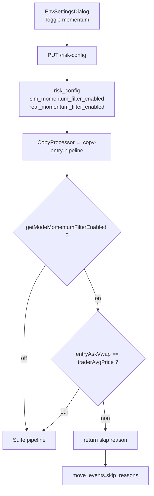

# Plan d'implémentation — Filtre momentum à l'entrée (toggle UI)

**Date** : 2026-06-21  
**Version** : Polywatch v0.8  
**Objet** : ajouter un filtre d'entrée « momentum » activable/désactivable par mode (sim / real), avec toggle dans l'UI Risk Config.  
**Statut global** : **À implémenter**

**Documents liés** :
- [2026-06-21_audit-selection-entree-pnl-copy-trading.md](./2026-06-21_audit-selection-entree-pnl-copy-trading.md) — diagnostic PnL et justification du filtre
- [2026-06-20_plan-optimisation-latence-pipelines.md](./2026-06-20_plan-optimisation-latence-pipelines.md) — latence (complémentaire, pas substitut)

---

## 1. Objectif fonctionnel

Lorsqu'activé pour un mode (`sim` ou `real`), le copy-processor **refuse une entrée** (`OPENED`, `INCREASED`) si le prix d'achat exécutable est **strictement inférieur** au prix moyen du trader sur cette position :

```
entryAskVwap >= traderAvgPrice   →  entrée autorisée
entryAskVwap <  traderAvgPrice   →  skip + raison persistée dans move_events.skip_reasons
```

**Toggle UI** : l'utilisateur active/désactive indépendamment en sim et en real (même pattern que `simSignalScoreSizingEnabled` / `realSignalScoreSizingEnabled`).

**Comportement par défaut** : **désactivé** (`false`) — pas de changement de comportement au déploiement tant que l'utilisateur n'active pas la feature.

---

## 2. Périmètre v1 / hors scope

| Inclus v1 | Hors scope v1 (phase ultérieure) |
|-----------|----------------------------------|
| Toggle on/off sim + real | Ratio minimum configurable (ex. 0,98) |
| Hard skip (B1) | Soft sizing via signal score (B2) |
| Moves `OPENED` + `INCREASED` | Filtre `minEntryPrice` séparé |
| Skip reason FR + log worker | Métriques Prometheus dédiées |
| Tests unitaires policy | Dashboard PnL filtré vs non filtré |

---

## 3. Architecture



Le filtre s'exécute **après** le VWAP final (`entryAskVwap` à la taille cible) et **avant** la réservation — même emplacement que le gate `minBidToAskRatio`.

---

## 4. Modèle de données

### 4.1 Nouvelles colonnes `risk_config`

| Colonne DB | Propriété TypeORM | Type | Default |
|------------|-------------------|------|---------|
| `sim_momentum_filter_enabled` | `simMomentumFilterEnabled` | boolean | `false` |
| `real_momentum_filter_enabled` | `realMomentumFilterEnabled` | boolean | `false` |

Fichier : `packages/core/src/entities/RiskConfig.ts`

```typescript
@Column({ type: 'boolean', name: 'sim_momentum_filter_enabled', default: false })
simMomentumFilterEnabled!: boolean;

@Column({ type: 'boolean', name: 'real_momentum_filter_enabled', default: false })
realMomentumFilterEnabled!: boolean;
```

### 4.2 Migration schema

TypeORM `synchronize: true` via script migrate (`packages/core/src/migrate.ts`) :

```bash
npm run migrate -w @polywatch/core
# ou équivalent monorepo existant
```

Vérifier que les colonnes apparaissent en PostgreSQL après migrate + redémarrage backend/worker.

---

## 5. Plan d'exécution en 5 phases

| Phase | Contenu | Effort | Fichiers |
|-------|---------|--------|----------|
| **1** | Core : entité + policy + exports | Faible | `RiskConfig.ts`, `policy.ts`, `sim-mode-fields.ts` |
| **2** | Worker : gate dans entry pipeline | Faible | `copy-entry-pipeline.ts` |
| **3** | Backend : validation API | Faible | `config.ts` |
| **4** | Frontend : toggle UI | Faible | `env-settings-types.ts`, `EnvSettingsDialog.tsx` |
| **5** | Tests + validation sim | Moyen | `policy.test.ts`, tests manuels |

---

## 6. Phase 1 — Core

### 6.1 `packages/core/src/risk/policy.ts`

Ajouter (miroir de `getModeMinBidToAskRatio` / `isEntryBidAskRatioAcceptable`) :

```typescript
export function getModeMomentumFilterEnabled(
  risk: RiskConfig,
  mode: TradingMode,
): boolean {
  return pickModeValue<boolean>(risk, mode, 'MomentumFilterEnabled');
}

/**
 * When enabled, reject copy entries where the executable ask is below the
 * trader's average position price (position already underwater).
 */
export function isMomentumEntryAcceptable(
  entryAskVwap: number,
  traderAvgPrice: number | null | undefined,
  enabled: boolean,
): boolean {
  if (!enabled) return true;
  if (!traderAvgPrice || traderAvgPrice <= 0) return true;
  if (entryAskVwap <= 0) return false;
  return entryAskVwap >= traderAvgPrice;
}
```

Exporter depuis `packages/core/src/index.ts` (ou barrel risk existant).

### 6.2 `packages/core/src/risk/sim-mode-fields.ts`

Ajouter aux listes :

```typescript
// SIM_RISK_CONFIG_KEYS
'simMomentumFilterEnabled',

// REAL_RISK_CONFIG_KEYS
'realMomentumFilterEnabled',
```

→ Propagation automatique vers snapshots sim (`extractSimConfigSnapshot`) et `pickModeFields` frontend.

### 6.3 Tests `packages/core/src/risk/policy.test.ts`

Cas à couvrir :

| Cas | enabled | entryAsk | traderAvg | Résultat |
|-----|---------|----------|-----------|----------|
| Désactivé | false | 0,30 | 0,50 | `true` |
| Au-dessus | true | 0,55 | 0,50 | `true` |
| Égal | true | 0,50 | 0,50 | `true` |
| En dessous | true | 0,45 | 0,50 | `false` |
| traderAvg null | true | 0,45 | null | `true` (fail-open) |
| traderAvg 0 | true | 0,45 | 0 | `true` (fail-open) |

---

## 7. Phase 2 — Worker

### 7.1 `packages/worker/src/processors/copy/copy-entry-pipeline.ts`

**Imports** :

```typescript
getModeMomentumFilterEnabled,
isMomentumEntryAcceptable,
```

**Insertion** (après le bloc `isEntryBidAskRatioAcceptable`, ~ligne 247, avant `hashCopyOrderSignalId`) :

```typescript
const momentumFilterEnabled = getModeMomentumFilterEnabled(risk, mode);
if (
  !isMomentumEntryAcceptable(
    entryAskVwap,
    move.traderAvgPrice,
    momentumFilterEnabled,
  )
) {
  log.warn(
    {
      moveId: move.id,
      mode,
      assetId: move.assetId,
      entryAskVwap,
      traderAvgPrice: move.traderAvgPrice,
      ratio:
        move.traderAvgPrice && move.traderAvgPrice > 0
          ? entryAskVwap / move.traderAvgPrice
          : null,
    },
    'entry skipped — price below trader average (momentum filter)',
  );
  return 'Entrée refusée — prix sous le niveau moyen du trader';
}
```

**Note** : `move.traderAvgPrice` est déjà disponible sur `MoveEventDto` (propagé depuis `move_events.trader_avg_price`).

### 7.2 Invalidation cache config

Le worker recharge déjà `risk` via `riskService.getConfig()` à chaque move + invalidation Redis `config-changed` (phase 4 audit latence). Aucun changement requis si ce mécanisme est en place.

---

## 8. Phase 3 — Backend API

### 8.1 `packages/backend/src/routes/config.ts`

Ajouter au schéma Zod `riskConfigUpdateSchema` :

```typescript
simMomentumFilterEnabled: z.boolean(),
realMomentumFilterEnabled: z.boolean(),
```

Pas de changement dans `presentRiskConfigForApi` / `toRiskConfigEntityUpdate` (spread automatique).

### 8.2 Seed / backfill

Mettre à jour les fixtures de test si présentes :

- `packages/core/src/seed/risk-config-backfill.test.ts`
- `packages/core/src/risk/sim-mode-fields.test.ts`
- `packages/core/src/risk/policy.test.ts`

Default `false` en seed — pas de backfill legacy nécessaire (nouvelle colonne).

---

## 9. Phase 4 — Frontend UI

### 9.1 `packages/frontend/src/components/env-settings-types.ts`

Les champs sont ajoutés automatiquement via `SIM_RISK_CONFIG_KEYS` / `REAL_RISK_CONFIG_KEYS` **si** les clés sont dans ces tableaux (phase 1). Vérifier que TypeScript infère bien :

```typescript
simMomentumFilterEnabled: boolean;
realMomentumFilterEnabled: boolean;
```

(Ajout explicite dans `EnvSettings` si l'inférence ne suffit pas.)

### 9.2 `packages/frontend/src/components/EnvSettingsDialog.tsx`

Dans l'onglet **Entrée** (`activeTab === 'entry'`), **après** le champ « Ratio bid/ask min » et **avant** « Ne pas entrer si le marché se ferme… » :

```tsx
<ToggleField
  label="Filtre momentum à l'entrée"
  checked={c()[modeSettingKey(props.mode, 'MomentumFilterEnabled')]}
  hint="Si activé, refuse de copier une entrée lorsque le prix d'achat est inférieur au prix moyen du trader sur cette position (position déjà sous l'eau)."
  onChange={(checked) =>
    patchConfig({
      [modeSettingKey(props.mode, 'MomentumFilterEnabled')]: checked,
    })
  }
/>
```

**Emplacement logique** : section filtres d'entrée (avec bid/ask min et min time to close), pas dans SizingSection.

### 9.3 (Optionnel) `packages/frontend/src/lib/sim-snapshot-compare.ts`

Si les snapshots sim affichent la config : ajouter une ligne « Filtre momentum » pour comparer les runs avant/après activation.

---

## 10. Phase 5 — Validation

### 10.1 Tests automatisés

```bash
npm test -w @polywatch/core -- policy.test
npm run build -w @polywatch/core
npm run build -w @polywatch/worker
npm run build -w @polywatch/frontend
```

### 10.2 Test manuel sim

1. Lancer stack dev (`npm run dev`).
2. Ouvrir **Paramètres → Simulation → Entrée**.
3. Activer **Filtre momentum à l'entrée** → sauvegarder.
4. Surveiller les move events : les entrées skippées doivent afficher  
   `Entrée refusée — prix sous le niveau moyen du trader` dans `skip_reasons.sim`.
5. Désactiver le toggle → les mêmes signaux doivent à nouveau tenter l'entrée (si autres gates OK).

### 10.3 Validation PnL (1–2 semaines)

Rejouer les requêtes SQL de l'audit PnL :

```sql
-- Comparer skip reasons après activation
SELECT skip_reasons, COUNT(*)
FROM move_events
WHERE event_type IN ('OPENED', 'INCREASED')
  AND detected_at > NOW() - INTERVAL '7 days'
GROUP BY skip_reasons;
```

Objectif : réduction des `PRE_CLOSE_LOSS` / `REDEMPTION` sur les nouvelles entrées, sans tuer le volume de `COPY_CLOSE`.

---

## 11. UX — libellés proposés

| Élément | Texte FR |
|---------|----------|
| Label toggle | Filtre momentum à l'entrée |
| Hint | Si activé, refuse de copier une entrée lorsque le prix d'achat est inférieur au prix moyen du trader sur cette position (position déjà sous l'eau). |
| Skip reason (worker) | Entrée refusée — prix sous le niveau moyen du trader |
| Log (pino) | `entry skipped — price below trader average (momentum filter)` |

---

## 12. Risques et garde-fous

| Risque | Mitigation |
|--------|------------|
| `trader_avg_price` absent ou stale | Fail-open : si null/0 → ne pas bloquer |
| Under-trading (trop de skips) | Toggle off par défaut ; validation sim avant real |
| Trader DCA à la baisse volontaire | Documenter dans hint ; phase 2 = ratio configurable |
| Colonne DB manquante au deploy | Exécuter `migrate` avant redémarrage worker |
| Confusion avec filtre bid/ask | Placer les deux toggles/champs côte à côte avec hints distincts |

---

## 13. Fichiers impactés (checklist)

- [ ] `packages/core/src/entities/RiskConfig.ts`
- [ ] `packages/core/src/risk/policy.ts`
- [ ] `packages/core/src/risk/policy.test.ts`
- [ ] `packages/core/src/risk/sim-mode-fields.ts`
- [ ] `packages/core/src/index.ts` (exports)
- [ ] `packages/worker/src/processors/copy/copy-entry-pipeline.ts`
- [ ] `packages/backend/src/routes/config.ts`
- [ ] `packages/frontend/src/components/env-settings-types.ts`
- [ ] `packages/frontend/src/components/EnvSettingsDialog.tsx`
- [ ] (optionnel) `packages/frontend/src/lib/sim-snapshot-compare.ts`
- [ ] (optionnel) fixtures seed/tests

---

## 14. Ordre de merge recommandé

1. **PR 1 — Core + tests** (entité, policy, sim-mode-fields, migrate)
2. **PR 2 — Worker gate** (dépend PR 1)
3. **PR 3 — Backend + Frontend** (API + toggle UI, peut être même PR que 2)

Ou **monolithique** si préféré (≈ 8 fichiers, diff ~150 lignes).

---

## 15. Phase 2 (future) — extensions possibles

| Extension | Description |
|-----------|-------------|
| `simMomentumMinRatio` | Seuil configurable (1,0 = strict, 0,98 = tolérance 2 %) |
| Intégration signal-scorer | Pénalité soft au lieu de hard skip |
| Métrique `polywatch_entry_momentum_skip_total` | Observabilité |
| Filtre sur move events UI | Badge « momentum blocked » dans le frontend |

---

## 16. Checklist go-live

- [ ] Colonnes DB créées (`migrate`)
- [ ] Tests policy verts
- [ ] Toggle visible sim + real dans UI
- [ ] Activé en **sim uniquement** pour période d'observation
- [ ] SQL backtest post-activation documenté
- [ ] Real : n'activer qu'après validation sim (≥ 1–2 semaines)
