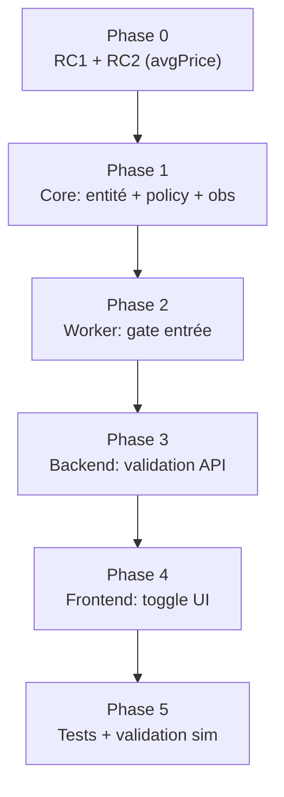

# Plan d'implémentation — Filtre momentum + causes racines `avgPrice`

**Date** : 2026-06-21  
**Version** : Polywatch v0.8  
**Objet** : implémenter le filtre momentum à l'entrée (toggle UI) **après** correction des causes racines qui le rendraient inopérant — l'absence fréquente de `trader_avg_price` sur les moves `OPENED`.  
**Statut global** : **À implémenter** — supersede le plan initial en y intégrant les causes racines découvertes lors de la revue.

> **Revue de code (2026-06-21)** — corrections appliquées après confrontation au code réel :
> - **RC1 déjà quasi corrigé** : `api-client.ts` utilise déjà `p.avgPrice != null ? Number(p.avgPrice) : undefined` (ligne 63, pas 58). Aucune coercition truthy ne subsiste ; seul le rejet `NaN` reste à ajouter (correctif mineur). Voir §3.
> - **§2 réinterprété** : `zero_avg = 0` n'est PAS une preuve de RC1 (le code préserve `0`). C'est cohérent avec RC2 (l'API omet le champ → NULL).
> - **Observabilité** : `prom-client` n'existe que dans le **backend** (`packages/backend/src/metrics.ts`). Le worker n'a aucun registre Prometheus → la métrique `momentum_entry_total` exige soit l'ajout d'infra au worker, soit une dérivation backend. En v1, l'observabilité repose sur les **logs structurés pino** déjà prévus (§8). Voir §7.3.
> - **Frontend** : l'ajout à l'interface `EnvSettings` est **obligatoire** (contrainte `satisfies keyof EnvSettings`), et `ToggleField` doit être importé dans `EnvSettingsDialog.tsx`. Voir §10.

**Documents liés** :
- [2026-06-21_plan-filtre-momentum-entree.md](./2026-06-21_plan-filtre-momentum-entree.md) — plan initial (sans causes racines)
- [2026-06-21_audit-selection-entree-pnl-copy-trading.md](./2026-06-21_audit-selection-entree-pnl-copy-trading.md) — diagnostic PnL
- [2026-06-20_plan-optimisation-latence-pipelines.md](./2026-06-20_plan-optimisation-latence-pipelines.md) — latence (complémentaire)

---

## 1. Synthèse exécutive

Le filtre momentum (`entryAskVwap >= traderAvgPrice` → sinon skip) est **pertinent** mais **inopérant en l'état** : **64 % des moves `OPENED` n'ont pas de `trader_avg_price`** (NULL), donc le filtre les laisserait tous passer (fail-open). Avant d'implémenter la feature, il faut **traiter deux causes racines** qui privent le filtre de sa donnée d'entrée.

| # | Cause racine | Nature | Effet sur le filtre |
|---|--------------|--------|---------------------|
| RC1 | Absence de garde `NaN` à l'ingestion API (coercition truthy **déjà corrigée**) | Code (mineur) | une string non numérique → `NaN` stocké (cas marginal) |
| RC2 | `avgPrice` absent de l'API `/positions` à l'instant du `OPENED` | Données / timing | 64 % des OPENED sans prix moyen — **cause dominante réelle** |

**Ordre d'exécution imposé** : RC2 (Phase 0) **avant** la feature (Phases 1–5), avec RC1 (garde `NaN`) en correctif de robustesse opportuniste. Sinon le toggle donne une fausse impression de filtrage. **RC2 est la cause structurante** ; RC1 ne réduit pas les 64 % de NULL.

---

## 2. Preuves (snapshot DB 2026-06-21)

```sql
SELECT event_type, COUNT(*) total,
       COUNT(*) FILTER (WHERE trader_avg_price IS NULL) null_avg,
       COUNT(*) FILTER (WHERE trader_avg_price = 0)     zero_avg,
       COUNT(*) FILTER (WHERE trader_avg_price > 0)     pos_avg
FROM move_events GROUP BY event_type;
```

| event_type | total | null_avg | zero_avg | pos_avg | NULL % |
|------------|-------|----------|----------|---------|--------|
| **OPENED** | 662 | **422** | 0 | 240 | **64 %** |
| INCREASED | 685 | 1 | 0 | 684 | 0,1 % |
| CLOSED | 66 | 0 | 0 | 66 | 0 % |
| DECREASED | 220 | 0 | 0 | 220 | 0 % |

Observations :
- `zero_avg = 0` partout → aucune valeur `0` n'est stockée. **Attention à l'interprétation** : le code d'ingestion (`p.avgPrice != null ? …`) **préserve** déjà un `0` légitime ; l'absence de `0` en base signifie donc que l'API ne renvoie **jamais** `avgPrice = 0` — elle **omet** le champ (→ `undefined` → NULL). C'est cohérent avec **RC2** (champ absent), pas avec une coercition truthy.
- Contraste **OPENED 64 % vs INCREASED 0,1 %** → l'`avgPrice` manque surtout **au moment précis de la première détection** d'une position (cohérent avec RC2).

---

## 3. Cause racine RC1 — Garde `NaN` manquante à l'ingestion (coercition truthy **déjà corrigée**)

**Fichier** : `packages/worker/src/polymarket/api-client.ts:63`

```typescript
// Actuel (déjà en place) — distingue absent (null/undefined) de présent, y compris 0
avgPrice: p.avgPrice != null ? Number(p.avgPrice) : undefined,
```

**Constat de revue** : la coercition *truthy* décrite dans le plan initial (`p.avgPrice ? …`) **n'existe plus** dans le code. La forme actuelle `p.avgPrice != null ? Number(p.avgPrice) : undefined` **préserve** déjà un `0` légitime et ne convertit en `undefined` que `null`/`undefined`. Le seul résidu : une string non numérique (`'abc'`) produit `Number('abc') = NaN`, stocké tel quel. Cas marginal (jamais observé en base), mais facile à blinder.

**Correction (robustesse, optionnelle)** :

```typescript
// Ajoute le rejet NaN au comportement actuel
avgPrice:
  p.avgPrice == null || Number.isNaN(Number(p.avgPrice))
    ? undefined
    : Number(p.avgPrice),
```

**Test** (`api-client.test.ts`) — le cas `'0.5'` existe déjà (`maps response fields correctly`, lignes 77–88). Avec le code **actuel**, `0`/`'0'`/`null`/`undefined` sont déjà gérés correctement ; seul le cas `NaN` change de comportement après le correctif ci-dessus :

| Input `avgPrice` | Code actuel | Après correctif NaN |
|------------------|-------------|---------------------|
| `'0.5'` | `0.5` ✅ (existant) | `0.5` |
| `0` (number) | `0` ✅ (déjà OK) | `0` |
| `'0'` | `0` ✅ (déjà OK) | `0` |
| `undefined` | `undefined` ✅ | `undefined` |
| `null` | `undefined` ✅ | `undefined` |
| `'abc'` (NaN) | `NaN` ⚠️ | `undefined` (seul cas modifié) |

> RC1 ne résout **pas** les 64 % de NULL (qui viennent de l'absence du champ, RC2). C'est un correctif de robustesse mineur et peu risqué — à ne pas surévaluer. **La cause structurante est RC2.**

---

## 4. Cause racine RC2 — `avgPrice` absent au moment du `OPENED`

**Fichiers** : `packages/worker/src/polymarket/api-client.ts` (fetch), `packages/core/src/services/poll-cycle.service.ts` (transitions).

**Hypothèse principale** (à confirmer, voir §4.1) : l'API Data `/positions` renvoie une position fraîchement ouverte avec `size > 0` mais `avgPrice` **non encore consolidé** (absent ou vide). Comme un `OPENED` est un **événement one-shot** (transition size 0 → N capturée une seule fois), il tombe exactement sur cet instant où `avgPrice` est le plus susceptible de manquer. Un `INCREASED` survient plus tard, une fois la position consolidée → 0,1 % de NULL seulement.

### 4.1 Diagnostic à exécuter avant correction

Capturer une réponse brute `/positions` pour un trader actif et inspecter le champ `avgPrice` sur des positions récentes :

```bash
curl "https://data-api.polymarket.com/positions?user=<TRADER>&limit=50&offset=0" \
  | jq '.[] | {conditionId, asset, size, avgPrice}'
```

- Si `avgPrice` est **présent mais `0`** → RC1 suffit.
- Si `avgPrice` est **absent du payload** sur des positions fraîches → RC2 confirmé, appliquer §4.2.
- Vérifier aussi le **nom exact** du champ (ex. `avgPrice` vs `curPrice` vs `realizedPnl`) — l'interface `DataApiPosition` suppose `avgPrice`.

### 4.2 Stratégies de remédiation (selon diagnostic)

| Stratégie | Description | Effort | Risque |
|-----------|-------------|--------|--------|
| **S1 — Backfill au prochain cycle** | Si `avgPrice` arrive NULL sur OPENED, le re-capturer au cycle suivant (quand consolidé) et mettre à jour `move_events` / `trader_snapshot` | Moyen | Faible |
| **S2 — Fallback prix marché** | À défaut d'`avgPrice` trader, utiliser le prix exécutable au moment du move comme proxy (moins fidèle) | Faible | Moyen (proxy biaisé) |
| **S3 — Enrichir via `/activity` ou `/trades`** | Récupérer le prix réel du trade trader (source événementielle) | Élevé | Élevé (voir audit latence Phase 5) |

**Recommandation v1** : **S1** (backfill différé). Le filtre momentum n'a pas besoin d'agir dans la milliseconde ; si `avgPrice` se consolide au cycle N+1, on peut soit retarder l'évaluation, soit accepter le fail-open pour ce move précis et compter sur RC1 + S1 pour réduire le taux de NULL au fil du temps.

> **Décision produit requise** : accepte-t-on que le filtre soit fail-open sur les OPENED dont l'`avgPrice` n'est pas encore consolidé, ou veut-on **bloquer** (fail-closed) ces entrées ? Fail-closed bloquerait 64 % des OPENED → trop agressif. **Fail-open recommandé** + observabilité (§7).

---

## 5. Modèle de données — feature

### 5.1 Colonnes `risk_config`

| Colonne DB | Propriété | Type | Default |
|------------|-----------|------|---------|
| `sim_momentum_filter_enabled` | `simMomentumFilterEnabled` | boolean | `false` |
| `real_momentum_filter_enabled` | `realMomentumFilterEnabled` | boolean | `false` |

Fichier : `packages/core/src/entities/RiskConfig.ts`

```typescript
@Column({ type: 'boolean', name: 'sim_momentum_filter_enabled', default: false })
simMomentumFilterEnabled!: boolean;

@Column({ type: 'boolean', name: 'real_momentum_filter_enabled', default: false })
realMomentumFilterEnabled!: boolean;
```

Migration : `synchronize: true` via `packages/core/src/migrate.ts` (PostgreSQL) — exécuter `migrate` **avant** redémarrage worker.

---

## 6. Plan d'exécution en 6 phases



| Phase | Contenu | Effort | Prérequis |
|-------|---------|--------|-----------|
| **0** | RC1 (garde `NaN`, mineur) + diagnostic RC2 + remédiation S1 | Moyen | — |
| **1** | Entité + `policy.ts` + compteurs observabilité | Faible | P0 |
| **2** | Gate dans `copy-entry-pipeline.ts` | Faible | P1 |
| **3** | Validation Zod `config.ts` | Faible | P1 |
| **4** | Toggle UI `EnvSettingsDialog.tsx` | Faible | P3 |
| **5** | Tests unitaires + validation sim 1–2 sem. | Moyen | P2–P4 |

---

## 7. Phase 1 — Core (policy + observabilité)

### 7.1 `packages/core/src/risk/policy.ts`

```typescript
export function getModeMomentumFilterEnabled(
  risk: RiskConfig,
  mode: TradingMode,
): boolean {
  return pickModeValue<boolean>(risk, mode, 'MomentumFilterEnabled');
}

export type MomentumDecision = 'pass' | 'block' | 'skip_no_avg';

/**
 * Momentum entry gate. Returns:
 * - 'pass'        : entry allowed (price >= trader avg, or filter disabled)
 * - 'block'       : entry rejected (price strictly below trader avg)
 * - 'skip_no_avg' : trader avg price unavailable → fail-open (do not block)
 */
export function evaluateMomentumEntry(
  entryAskVwap: number,
  traderAvgPrice: number | null | undefined,
  enabled: boolean,
): MomentumDecision {
  if (!enabled) return 'pass';
  if (traderAvgPrice == null || traderAvgPrice <= 0) return 'skip_no_avg';
  if (entryAskVwap <= 0) return 'skip_no_avg';
  return entryAskVwap >= traderAvgPrice ? 'pass' : 'block';
}
```

> Le retour à 3 états (au lieu d'un booléen) est **volontaire** : il rend visible le cas `skip_no_avg` pour l'observabilité (§7.3) — sinon les 64 % de NULL seraient invisibles.

### 7.2 `packages/core/src/risk/sim-mode-fields.ts`

Ajouter `'simMomentumFilterEnabled'` à `SIM_RISK_CONFIG_KEYS` et `'realMomentumFilterEnabled'` à `REAL_RISK_CONFIG_KEYS`.

### 7.3 Observabilité (obligatoire en v1, pas reportée)

**Contrainte d'architecture (revue)** : `prom-client` n'est présent **que dans le backend** (`packages/backend/src/metrics.ts`, registre `createAppMetrics`). Le **worker n'a aucun registre Prometheus ni endpoint `/metrics`**. La métrique idéale :

```
polywatch_momentum_entry_total{mode="sim", decision="pass|block|skip_no_avg"}
```

…n'est donc **pas branchable telle quelle** dans `copy-entry-pipeline.ts`. Trois options :

| Option | Description | Effort |
|--------|-------------|--------|
| **O1 — Logs structurés pino (v1 recommandé)** | Émettre un log par décision (déjà prévu §8) avec un champ `momentumDecision`; agréger via la stack de logs. Aucune nouvelle dépendance worker. | Faible |
| **O2 — Compteur Prometheus dans le worker** | Ajouter `prom-client` + un registre + un endpoint `/metrics` au worker, puis `momentumCounter.inc(...)`. | Moyen |
| **O3 — Dérivation backend** | Compter côté backend à partir des moves / logs persistés. | Moyen |

**Recommandation v1 : O1** (logs structurés), suffisant pour distinguer « filtre actif » de « filtre court-circuité faute d'avgPrice ». **C'est le garde-fou anti bug-fantôme de perception.** Le PromQL de §11.3 ne s'applique qu'avec O2/O3.

### 7.4 Exports

`getModeMomentumFilterEnabled`, `evaluateMomentumEntry` et `MomentumDecision` sont exportés **automatiquement** : `packages/core/src/index.ts` fait déjà `export * from './risk/policy.js'` (ligne 27). **Aucune modification du barrel n'est nécessaire** dès lors que les symboles sont déclarés/exportés dans `policy.ts`.

---

## 8. Phase 2 — Worker (gate)

**Fichier** : `packages/worker/src/processors/copy/copy-entry-pipeline.ts`

Insertion **après** le gate `isEntryBidAskRatioAcceptable` (bloc se terminant ligne ~250), **avant** `const reason = move.type === 'OPENED' ? ...` (ligne ~252) — couvre ainsi le chemin nouvelle réservation **et** resume (le bloc `existingReservation` est en aval, lignes ~260–283).

> **Note (revue)** : `entryAskVwap` est bien disponible à cet endroit (défini ligne ~203 via `entryLiquidity.executableAskVwap`).

```typescript
const momentumEnabled = getModeMomentumFilterEnabled(risk, mode);
const momentumDecision = evaluateMomentumEntry(
  entryAskVwap,
  move.traderAvgPrice, // DTO: number, vaut 0 si non consolidé
  momentumEnabled,
);
// Observabilité v1 : log structuré (le worker n'a pas de registre Prometheus — cf. §7.3 O1).
// Le compteur `momentumCounter.inc(...)` n'est valable qu'avec l'option O2/O3.
if (momentumDecision === 'block') {
  log.warn(
    {
      momentumDecision, // champ stable pour agrégation O1
      moveId: move.id,
      mode,
      assetId: move.assetId,
      entryAskVwap,
      traderAvgPrice: move.traderAvgPrice,
      ratio: move.traderAvgPrice > 0 ? entryAskVwap / move.traderAvgPrice : null,
    },
    'entry blocked — price below trader average (momentum filter)',
  );
  return 'Entrée refusée — prix sous le niveau moyen du trader';
}
if (momentumDecision === 'skip_no_avg' && momentumEnabled) {
  log.info(
    { momentumDecision, moveId: move.id, mode, assetId: move.assetId },
    'momentum filter skipped — no trader avg price (fail-open)',
  );
}
```

**Note de cohérence** : `move.traderAvgPrice` est typé `number` sur `MoveEventDto` (jamais null ; `?? 0` dans les deux `toDto`). La garde `traderAvgPrice <= 0` dans `evaluateMomentumEntry` couvre donc bien le cas non consolidé.

---

## 9. Phase 3 — Backend API

**Fichier** : `packages/backend/src/routes/config.ts` — ajouter au schéma Zod :

```typescript
simMomentumFilterEnabled: z.boolean(),
realMomentumFilterEnabled: z.boolean(),
```

Aucun changement dans `presentRiskConfigForApi` / `toRiskConfigEntityUpdate` (spread automatique). Cache config invalidé par `updateConfig` (`RiskService.invalidateConfigCache`, TTL 5 s) → toggle effectif immédiatement.

---

## 10. Phase 4 — Frontend (toggle)

**Fichier** : `packages/frontend/src/components/EnvSettingsDialog.tsx` — onglet **Entrée**, après « Ratio bid/ask min à l'entrée » (NumberField ~ligne 197–209), avant « Ne pas entrer si le marché se ferme… » (~ligne 210) :

> **Import requis (revue)** : `ToggleField` n'est **pas** importé dans `EnvSettingsDialog.tsx` (composant défini dans `settings-fields.tsx`, signature `{ label, checked, onChange, hint }` — compatible). Ajouter `ToggleField` à l'import existant depuis `./settings-fields`.

```tsx
<ToggleField
  label="Filtre momentum à l'entrée"
  checked={c()[modeSettingKey(props.mode, 'MomentumFilterEnabled')]}
  hint="Refuse de copier une entrée si le prix d'achat est inférieur au prix moyen du trader (position déjà sous l'eau). Sans effet si le prix moyen du trader n'est pas encore disponible."
  onChange={(checked) =>
    patchConfig({
      [modeSettingKey(props.mode, 'MomentumFilterEnabled')]: checked,
    })
  }
/>
```

**Fichier** : `packages/frontend/src/components/env-settings-types.ts` — ajout **OBLIGATOIRE** à l'interface `EnvSettings` :

```typescript
simMomentumFilterEnabled: boolean;
realMomentumFilterEnabled: boolean;
```

> **Pourquoi obligatoire (revue)** : `SIM_FIELDS`/`REAL_FIELDS` sont définis par
> `[...SIM_RISK_CONFIG_KEYS] as const satisfies readonly (keyof EnvSettings)[]`.
> Si l'on ajoute les clés à `SIM_RISK_CONFIG_KEYS`/`REAL_RISK_CONFIG_KEYS` (§7.2) **sans**
> les déclarer dans `EnvSettings`, la contrainte `satisfies keyof EnvSettings` **échoue à la compilation**.
> Ce n'est donc pas conditionnel.

Le hint mentionne explicitement la limite « si prix moyen disponible » pour éviter la fausse confiance.

---

## 11. Phase 5 — Tests et validation

### 11.1 Tests unitaires

**`packages/core/src/risk/policy.test.ts`** — `evaluateMomentumEntry` :

| enabled | entryAsk | traderAvg | Attendu |
|---------|----------|-----------|---------|
| false | 0,30 | 0,50 | `pass` |
| true | 0,55 | 0,50 | `pass` |
| true | 0,50 | 0,50 | `pass` |
| true | 0,45 | 0,50 | `block` |
| true | 0,45 | 0 | `skip_no_avg` |
| true | 0,45 | null | `skip_no_avg` |
| true | 0 | 0,50 | `skip_no_avg` |

**`packages/worker/src/polymarket/api-client.test.ts`** — RC1 (cas `0`, `'0'`, `null`, NaN) — voir §3.

**`packages/core/src/risk/sim-mode-fields.test.ts`** — **OBLIGATOIRE** : ajouter `simMomentumFilterEnabled` au fixture `baseRiskConfig()`. Sans cela le test boucle sur `undefined === undefined` et passe **à tort**.

### 11.2 Build

```bash
npm run build -w @polywatch/core
npm run build -w @polywatch/worker
npm run build -w @polywatch/frontend
npm test -w @polywatch/core
npm test -w @polywatch/worker
```

### 11.3 Validation runtime (sim)

1. Diagnostic RC2 (§4.1) exécuté et documenté.
2. Activer le toggle en **sim uniquement**.
3. Vérifier la répartition des décisions :

- **Avec O1 (logs pino, v1)** — agréger sur le champ `momentumDecision` des logs worker (ex. via la stack de logs / `jq` sur les logs persistés).
- **Avec O2/O3 (Prometheus)** — si l'infra métrique a été ajoutée :

```promql
sum by (decision) (polywatch_momentum_entry_total{mode="sim"})
```

Objectif : `block` + `pass` doivent représenter une part significative ; si `skip_no_avg` domine (>50 %), **RC2 n'est pas résolu** → revenir Phase 0.

4. Après 1–2 semaines : rejouer le backtest PnL de l'audit sur les nouvelles entrées.

---

## 12. Risques et garde-fous

| Risque | Sévérité | Mitigation |
|--------|----------|------------|
| Filtre no-op sur 64 % des OPENED (RC2 non résolu) | 🔴 | Phase 0 obligatoire + métrique `skip_no_avg` |
| Fausse confiance utilisateur | 🟠 | Hint UI explicite + observabilité (O1 logs en v1) |
| Observabilité absente côté worker (pas de Prometheus) | 🟠 | v1 = logs pino `momentumDecision` (O1) ; Prometheus worker hors v1 (§7.3) |
| Frontend ne compile pas (clés absentes de `EnvSettings`) | 🟠 | Ajout obligatoire à l'interface `EnvSettings` + import `ToggleField` (§10) |
| Fixture test passe à tort | 🟠 | §11.1 mise à jour obligatoire `baseRiskConfig` |
| RC1 régression mapping | 🟡 | Code déjà robuste (`!= null`) ; test api-client pour le seul cas NaN |
| Sémantique INCREASED ≠ OPENED | 🟡 | `traderAvgPrice` = moyenne courante ; documenté dans le hint |
| Colonne DB manquante au deploy | 🟡 | `migrate` avant redémarrage worker |
| Toggle « collant » (cache) | 🟢 | Invalidation cache vérifiée (TTL 5 s + config-changed) |

---

## 13. Divergence backtest vs runtime (à garder en tête)

- **Backtest audit** : compare `copied_positions.entry_price` (fill réalisé) à `trader_avg_price`, sur le sous-ensemble `IS NOT NULL` (~36 % des OPENED).
- **Runtime** : compare `entryAskVwap` (quote **avant** fill) à `move.traderAvgPrice`.

→ L'effet réel du filtre pourra **diverger** du backtest, d'autant plus que le backtest exclut justement les 64 % de NULL que le runtime devra gérer. Ne pas promettre le chiffre du backtest tant que RC2 n'est pas résolu et mesuré.

---

## 14. Fichiers impactés (checklist)

**Phase 0 — causes racines**
- [x] `packages/worker/src/polymarket/api-client.ts` (RC1 — garde `NaN`)
- [x] `packages/worker/src/polymarket/api-client.test.ts` (RC1 — cas `0`/`'0'`/`null`/NaN)
- [ ] Diagnostic RC2 (capture `/positions`) + remédiation S1 (fichiers selon stratégie) — **non livré (runtime/données)**

**Phases 1–4 — feature**
- [x] `packages/core/src/entities/RiskConfig.ts`
- [x] `packages/core/src/risk/policy.ts`
- [x] `packages/core/src/risk/sim-mode-fields.ts`
- [x] `packages/core/src/index.ts` — aucun changement requis (`export *` déjà en place)
- [x] `packages/worker/src/processors/copy/copy-entry-pipeline.ts` (gate + logs `momentumDecision`)
- [~] observabilité : **O1 livré** (logs structurés pino `momentumDecision`) ; O2 (Prometheus worker) hors v1
- [x] `packages/backend/src/routes/config.ts` (schéma Zod whitelist `.strict()`)
- [x] `packages/frontend/src/components/env-settings-types.ts` (interface `EnvSettings`)
- [x] `packages/frontend/src/components/EnvSettingsDialog.tsx` (toggle + import `ToggleField`)

**Phase 5 — tests**
- [x] `packages/core/src/risk/policy.test.ts` (7 cas `evaluateMomentumEntry` + per-mode)
- [x] `packages/core/src/risk/sim-mode-fields.test.ts` (fixture `simMomentumFilterEnabled`)
- [x] `packages/core/src/seed/risk-config-backfill.test.ts` (fixture complète mise à jour)

---

## 15. Ordre de merge recommandé

1. **PR 1 — Phase 0** : RC1 + diagnostic/remédiation RC2 (indépendant de la feature, valeur immédiate sur la qualité des données).
2. **PR 2 — Core + tests** : entité, policy, observabilité, sim-mode-fields.
3. **PR 3 — Worker gate** (dépend PR 2).
4. **PR 4 — Backend + Frontend** : API + toggle UI.

> Ne pas livrer PR 2–4 sans PR 1 : la feature serait cosmétique sur les OPENED.

---

## 16. Checklist go-live

- [x] RC1 corrigé + testé
- [ ] RC2 diagnostiqué (capture API documentée) + remédiation S1 livrée
- [ ] Taux `skip_no_avg` mesuré < 20 % en sim avant d'annoncer le filtre « actif »
- [ ] Colonnes DB créées (`migrate` — `synchronize: true`, à exécuter/redémarrer le worker)
- [x] Tests verts (policy, api-client, fixtures) — core 218, worker 60
- [x] Toggle visible sim + real (onglet Entrée)
- [ ] Activé en **sim uniquement** pour observation
- [ ] Real : uniquement après validation sim ≥ 1–2 semaines
