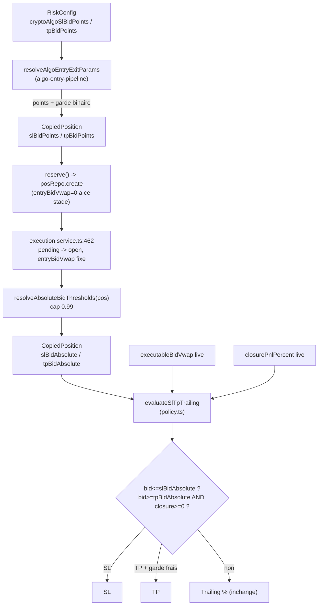

# Patch : SL/TP en bid absolu (points de probabilité) pour marchés binaires crypto-algo

**Date** : 2026-07-06
**Statut** : **Implémenté** (avec corrections post-audit verify-implementation)
**Contexte** : Audit `../audits/2026-07-06_audit-seuils-pourcent-binaire-crypto-algo.md`
**Objectif** : Corriger l'adéquation des seuils SL/TP aux marchés binaires [0,1] en ajoutant un mode « bid absolu » coexistant avec le mode % existant. Subsume le patch P2 (TP plafonné vers 1,0) encore en attente.

---

## 1. Résumé

| # | Patch | Priorité | Type | Statut |
|---|---|---|---|---|
| 3 | SL/TP en bid absolu (points de probabilité) | **P3** | Code core + worker + UI + backend | **Implémenté** |

## 2. Problème

Les seuils SL/TP actuels sont en **% relatif** (ex : SL 12 %, TP 45 %). Sur un marché binaire [0,1] :
- SL 12 % à entry 0,40 = bid 0,352 (?4,8 pts) ; à entry 0,85 = bid 0,748 (?10,2 pts). **Protection inégale** selon l'entry.
- TP 45 % à entry 0,70 = bid 1,015 ? **impossible** (bid plafonné à 1,0). TP jamais atteint pour les entries hautes.
- Whipsaw : un SL en % réagit au bruit de court terme, pas à la perte "absolue" réelle.
- REDEMPTION : un SL trop tardif (parce que le % est "suffisant" sur le papier) laisse la position expirer en perte totale (`no_payout`).

Voir audit `../audits/2026-07-06_audit-seuils-pourcent-binaire-crypto-algo.md` pour les 4 conséquences concrètes (positions 16029, 16041, etc.).

## 3. Solution

Ajouter un mode SL/TP **bid absolu** (en points de probabilité) pour les marchés binaires :
- `slBidPoints = 0.10` ? SL déclenche quand `executableBidVwap <= entryBidVwap - 0.10`.
- `tpBidPoints = 0.12` ? TP déclenche quand `executableBidVwap >= min(entryBidVwap + 0.12, 0.99)` AND garde frais.

Coexistence : si `slBidAbsolute` est non-null, la branche absolu `return` avant la branche %. Mode % inchangé pour les positions existantes (`slBidAbsolute = null`).

---

## 4. Décisions de conception (après revue code)

### 4.1 Référence = `entryBidVwap` (pas le best bid WS)

- `entryBidVwap` = VWAP exécutable pour la qty de la position au moment du fill (`execution.service.ts:466`). Immuable post-fill.
- Cohérent avec `triggerPnlPercent` (`effectiveTrigger = bid vs entryBidVwap`) — même référence que le mode %.
- Le best bid WS serait anti-conservateur : volatile, top-of-book seulement, casserait la sémantique « seuil fixé à l'entry ».

### 4.2 Calcul au fill, pas à la réservation

`entryBidVwap = 0` à la réservation (`reservation.service.ts:165`), fixé au fill (`execution.service.ts:462-470`). On stocke donc `slBidPoints`/`tpBidPoints` (points non résolus) à la réservation, puis on calcule `slBidAbsolute`/`tpBidAbsolute` au fill quand `entryBidVwap` est connu.

### 4.3 Cap TP à 0,99 (pas 1,0)

Un bid ne peut pas dépasser 1,0 sur un binaire. Cap à 1,0 strict rendrait le TP unreachable pour les entrées hautes (ex : entry 0,95 + 0,10 = 1,05 capé à 1,0 ? TP impossible). Cap à **0,99** pour rester atteignable.

### 4.4 Garde binaire à la résolution

On ne calcule `slBidAbsolute`/`tpBidAbsolute` que si `byInterval != null` (marché binaire reconnu). Un override global `cryptoAlgoSlBidPoints` seul, sans interval, ne doit PAS produire de seuil absolu sur une position non-binaire (sinon bug fantôme : SL binaire appliqué à un marché non-binaire).

### 4.5 Sémantique de comparaison

- **SL** : `executableBidVwap <= slBidAbsolute` (opérateur `<=` cohérent avec le mode %). Pas de garde frais — une perte est une perte.
- **TP** : `executableBidVwap >= tpBidAbsolute AND closurePnlPercent(executableBidVwap, entryPrice, entryFeesRemaining, entryQuantityRemaining) >= 0`. Garde frais (cohérent avec le AND du mode %) pour éviter de vendre à un bid qui, après frais, est encore en perte nette. Sans cette garde : bug fantôme — TP déclenche sur un gain comptable qui s'évapore avec les frais.

### 4.6 Trailing reste en %

Coexistence SL absolu + trailing % est sûre : l'ordre d'évaluation SL ? TP ? trailing est fixe et chaque bloc `return` dès le premier match (`policy.ts:415-435`). `peakClosurePnlPercent` (en %) reste indépendant du mode SL.

### 4.7 Décisions post-audit verify-implementation (06/07)

Trois points ont été identifiés lors de l'audit de l'implémentation et résolus :

**(a) Override `0` = désactivé (bug fantôme #1)** : Un utilisateur saisissant `0` dans le champ « Stop Loss (points bid) » pour désactiver le mode absolu aurait provoqué un SL immédiat (`slBidAbsolute = entryBidVwap - 0 = entryBidVwap`, déclenché au premier tick à cause du spread). **Fix** : `pickAlgoBidPointsThreshold` traite `0` et les valeurs négatives comme `null` (désactivé), cohérent avec `pickAlgoExitThreshold` pour les %. Pas de fallback sur le default intervalle — `0` = explicitement désactivé ? fallback mode %.

**(b) Incohérence conservateur (bug réel #2) — NON corrigé, justifié** : `evaluateSlTpTrailing` reçoit `executableBidVwap` brut (non conservateur) alors que `effectiveTrigger`/`effectiveClosure` peuvent refléter un mark conservateur (`min(bookBid, wsBestBid, lastTradePrice)`). Décision : **garder `executableBidVwap` brut**, confirmé par la doc Polymarket CLOB V2 — en marché illiquide, les ordres FAK sont rejetés ("no orders found to match with FAK order") et aucun fill n'est possible sans contrepartie. De plus, le guard `emitBid > 0` (`position-exit-evaluator.ts:229`) bloque l'émission du signal SL s'il n'y a pas de bid valide. Le SL absolu sur un bid brut = 0 ne produit donc jamais d'ordre fantôme.

**(c) Recalcul sur `ALGO_INCREASE` (bug réel #3)** : Sur une augmentation (`pos.status === 'open'` branche `else if`), `entryBidVwap` est recalculé (moyenne pondérée) mais les seuils absolus ne l'étaient pas dans l'implémentation initiale. **Fix** : extraction du helper `resolveAbsoluteBidThresholds(pos)` appelé dans les deux branches (`pending ? open` ET `open ? open`) après mise à jour de `entryBidVwap`. Le TP absolu aurait sinon déclenché trop tôt après une augmentation faisant monter `entryBidVwap`.

---

## 5. Diagramme du flux



---

## 6. Implémentation

### 6.1 Schéma DB

Ajouter 4 colonnes :
- `copied_positions` : `sl_bid_points`, `tp_bid_points` (real, nullable — points non résolus, stockés à la réservation), `sl_bid_absolute`, `tp_bid_absolute` (real, nullable — seuils calculés au fill).
- `risk_config` : `crypto_algo_sl_bid_points`, `crypto_algo_tp_bid_points` (real, nullable, default null).

Fichiers :
- `packages/core/src/entities/CopiedPosition.ts:76-86` (suivre le pattern `@Column({ type: 'real', nullable: true })`).
- `packages/core/src/entities/RiskConfig.ts:312-326`.

### 6.2 Migration

Créer `packages/core/src/migrations/AddCryptoAlgoBidAbsoluteSlTp1700000000025.ts` (pattern hand-written SQL, `ADD COLUMN IF NOT EXISTS`, `DROP COLUMN IF EXISTS` dans `down`).

```sql
ALTER TABLE "copied_positions"
  ADD COLUMN IF NOT EXISTS "sl_bid_points" real
ALTER TABLE "copied_positions"
  ADD COLUMN IF NOT EXISTS "tp_bid_points" real
ALTER TABLE "copied_positions"
  ADD COLUMN IF NOT EXISTS "sl_bid_absolute" real
ALTER TABLE "copied_positions"
  ADD COLUMN IF NOT EXISTS "tp_bid_absolute" real
ALTER TABLE "risk_config"
  ADD COLUMN IF NOT EXISTS "crypto_algo_sl_bid_points" real
ALTER TABLE "risk_config"
  ADD COLUMN IF NOT EXISTS "crypto_algo_tp_bid_points" real
```

**Enregistrer** dans `packages/core/src/database/data-source.ts:55` après `AddCryptoAlgoExitDefaults1700000000024` (sinon ne tourne pas en prod où `synchronize = false`).

### 6.3 Résolution à l'entrée

Étendre `AlgoEntryExitParams` et `resolveAlgoEntryExitParams` dans `packages/core/src/risk/crypto-algo-exit.ts:136-168` :
- Ajouter `slBidPoints` / `tpBidPoints` au type de retour.
- Résolution via le helper `pickAlgoBidPointsThreshold(algoOverride, intervalDefault)` : override `cryptoAlgoSlBidPoints` ? interval default (ex : 5m = 0,10 SL / 0,12 TP) ? null. **`0` et valeurs négatives = `null` (désactivé)**, voir §4.7(a).
- **Garde binaire obligatoire** : ne retourner des points non-null que si `byInterval != null`. Sinon null (fallback mode %). Ne JAMAIS fallback vers un default mode-level absolu.

### 6.4 Stockage à la réservation

Ajouter `slBidPoints` / `tpBidPoints` à l'interface `ReserveInput` dans `packages/core/src/services/reservation.service.ts:28-42` et au `posRepo.create({...})` à la ligne 157-174 (pattern `slBidPoints: input.slBidPoints ?? null`). Pas de migration sur `PositionReservation` (vérifié : l'entité ne stocke pas SL/TP).

Propager depuis `packages/crypto-algo/src/processors/algo-entry-pipeline.ts:369-382`.

### 6.5 Calcul au fill

Dans `packages/core/src/services/execution.service.ts`, helper extrait `resolveAbsoluteBidThresholds(pos)` :

```typescript
export function resolveAbsoluteBidThresholds(pos: CopiedPosition): void {
  if (pos.slBidPoints != null && pos.entryBidVwap > 0) {
    pos.slBidAbsolute = pos.entryBidVwap - pos.slBidPoints;
  }
  if (pos.tpBidPoints != null && pos.entryBidVwap > 0) {
    pos.tpBidAbsolute = Math.min(pos.entryBidVwap + pos.tpBidPoints, 0.99);
  }
}
```

Appelé dans `finalize` dans les **deux** branches après mise à jour de `entryBidVwap` :
- branche `pending ? open` (premier fill, `entryBidVwap` fixé depuis `input.entryBidVwap ?? input.fillPrice`) ;
- branche `open ? open` (`ALGO_INCREASE` / `COPY_INCREASE`, `entryBidVwap` recalculé en moyenne pondérée). Voir §4.7(c).

Garder les `slBidPoints`/`tpBidPoints` intacts pour audit. Cas `entryBidVwap == 0` : ne pas calculer (le seuil reste null, fallback mode %). Cap TP à 0,99 (voir §4.3).

### 6.6 Évaluation SL/TP

Étendre `evaluateSlTpTrailing` dans `packages/core/src/risk/policy.ts:384-438` :
- Ajouter params **optionnels** au `input` : `executableBidVwap?: number`, `slBidAbsolute?: number | null`, `tpBidAbsolute?: number | null`. `effectiveClosure` est déjà présent (sert au garde frais TP).
- Ajouter une branche AVANT le bloc % :
  - `if (slBidAbsolute != null && executableBidVwap != null && executableBidVwap <= slBidAbsolute) return 'SL'`
  - `if (tpBidAbsolute != null && executableBidVwap != null && executableBidVwap >= tpBidAbsolute && effectiveClosure >= 0) return 'TP'`
- Préserver la priorité SL absolu ? TP absolu ? SL % ? TP % ? trailing %.
- Thread via `evaluatePositionExit` (`packages/core/src/risk/exit-decision.ts:127-157`) : ajouter les champs au `slTpInput`. `SlTpTrailingInput` auto-track via `Parameters<typeof evaluateSlTpTrailing>[0]`.
- Seul caller production : `packages/worker/src/processors/strategy/position-exit-evaluator.ts:157-166` où `executableBidVwap` et `pos.slBidAbsolute`/`pos.tpBidAbsolute` sont déjà en scope. Params optionnels = non-breaking pour les tests existants.

### 6.7 UI

Ajouter 2 champs `NullableNumberField` dans `packages/frontend/src/components/CryptoAlgoSettingsExitTab.tsx:26-69` après les champs % :
- Label "Stop Loss (points bid)" / "Take Profit (points bid)"
- `min={0} max={1} step={0.01}`
- Hint : "Points de bid sous/au-dessus du bid d'entrée. 0..1. Vide = mode % uniquement. Marchés binaires seulement."
- Ajouter au type `CryptoAlgoSettings` (`crypto-algo-settings-types.ts`) et au type `EnvSettings` (`env-settings-types.ts`).

### 6.8 Validation backend

Étendre le schéma Zod `riskConfigUpdateSchema` dans `packages/backend/src/routes/config.ts` pour inclure les nouveaux champs (le schéma utilise `.strict()` qui rejette les clés inconnues) :

```typescript
cryptoAlgoSlBidPoints: z.number().min(0).max(1).nullable(),
cryptoAlgoTpBidPoints: z.number().min(0).max(1).nullable(),
```

Sans cette étape : erreur `invalid_body:: Unrecognized key(s)` lors de la sauvegarde depuis l'UI.

### 6.9 Defaults 5m (point de départ, à calibrer)

`CRYPTO_INTERVAL_EXIT_DEFAULTS` étendu pour 5m :
- `slBidPoints: 0.10` (SL à entryBidVwap ? 0,10)
- `tpBidPoints: 0.12` (TP à min(entryBidVwap + 0,12, 0,99))

**Note de calibration** : à entry 0,55, SL absolu = bid 0,45 (?10 pts) vs SL 12 % = bid 0,484 (?6,6 pts) ? plus strict. TP absolu = bid 0,67 (+12 pts) vs TP 45 % = bid 0,798 (+24,8 pts) ? plus serré. Ces valeurs sont un **point de départ**, à valider sur session réelle post-deploy. Risque résiduel documenté au §8.

---

## 7. Tests

### 7.1 `packages/core/src/risk/policy.test.ts`

8 tests pour la branche absolue :
- SL absolu uniforme (entry 0,40 et 0,85, slBidPoints 0,10 ? même delta absolu)
- TP plafonné à 0,99 (entry 0,95, tpBidPoints 0,10 ? tpBidAbsolute = 0,99, pas 1,05)
- TP avec garde frais (bid ? tpBidAbsolute mais `effectiveClosure < 0` ? pas de TP)
- TP déclenchable (entry 0,55, tpBidPoints 0,12, bid 0,68, closure ? 0 ? TP)
- Coexistence (slBidAbsolute = null ? fallback % inchangé)
- Priorité SL absolu > TP absolu > SL % > TP % > trailing

### 7.2 `packages/core/src/risk/crypto-algo-exit.test.ts`

4 tests pour `pickAlgoBidPointsThreshold` / `resolveAlgoEntryExitParams` :
- Résolution points ? seuil absolu à l'entry
- Garde binaire (byInterval null ? slBidPoints null même si override global set)
- Cap 0,99
- **Override `0` = désactivé** (slBidPoints null, fallback mode %) — voir §4.7(a)
- **Override négatif = désactivé** (slBidPoints null)
- Override positif pris en compte

### 7.3 `packages/core/src/services/execution.service.test.ts`

5 tests pour le helper `resolveAbsoluteBidThresholds` :
- Calcul slBidAbsolute/tpBidAbsolute au fill (pending ? open)
- Cas `entryBidVwap = 0` au fill (pas de calcul, seuil reste null)
- Cap 0,99
- **Recalcul sur ALGO_INCREASE** (entryBidVwap recalculé ? slBidAbsolute/tpBidAbsolute recalculés) — voir §4.7(c)
- Helper exporté et testé isolément

---

## 8. Risques résiduels acceptés

| Risque | Mitigation |
|---|---|
| Calibration 0,10/0,12 matériellement plus stricte que le % actuel | À valider post-deploy via re-audit. Pas un bug, un choix de stratégie. |
| Mode mixte %/absolu sur une même position | Impossible par construction (si slBidAbsolute non-null, la branche absolu `return` avant la branche %). |
| Écart partial-close % vs absolu | Le mode absolu ne réagit pas à la concentration des frais sur partial close. Accepté (documenté dans le code par un commentaire). |

---

## 9. Validation

```bash
npm run test -w @polywatch/core -- policy crypto-algo-exit execution.service
npm run test -w @polywatch/worker -- position-exit-evaluator
npx tsx tools/audit-crypto-algo-exits.ts
npx tsx tools/audit-redemption-sl-miss.ts
```

### Critères de succès (session sim 5m complète)

| Critère | Seuil |
|---|---|
| REDEMPTION `no_payout` en perte | **0** |
| REDEMPTION total | **< 5 %** |
| TP déclenchements | **> 5 %** (vs 5,3 % avant) |
| SL + TIME_EXIT + TP | **> 90 %** |
| Positions non-binaires avec `slBidAbsolute` non-null | **0** (garde binaire) |

### Non-régression

- Mode % inchangé quand `slBidAbsolute = null` (toutes les positions existantes)
- `triggerPnlPercent` / `closurePnlPercent` conservés (PnL reporting et mode %)
- Trailing reste en % (coexistence sûre via ordre d'évaluation fixe)
- `shouldSuppressSlTp` : inchangé (outcome connu seulement)
- Pre-close / TIME_EXIT : inchangés

---

## 10. Rollback

| Patch | Rollback |
|---|---|
| Migration | `down()` de `AddCryptoAlgoBidAbsoluteSlTp1700000000025.ts` (DROP COLUMN IF EXISTS) |
| Code | Revert git du PR |
| Config | `UPDATE risk_config SET crypto_algo_sl_bid_points = NULL, crypto_algo_tp_bid_points = NULL` |

---

## 11. Fichiers impactés

| Fichier | Changement |
|---|---|
| `packages/core/src/entities/CopiedPosition.ts` | +4 colonnes (slBidPoints, tpBidPoints, slBidAbsolute, tpBidAbsolute) |
| `packages/core/src/entities/RiskConfig.ts` | +2 colonnes (cryptoAlgoSlBidPoints, cryptoAlgoTpBidPoints) |
| `packages/core/src/migrations/AddCryptoAlgoBidAbsoluteSlTp1700000000025.ts` | Nouvelle migration |
| `packages/core/src/database/data-source.ts` | Enregistrer la migration |
| `packages/core/src/risk/crypto-algo-exit.ts` | `AlgoEntryExitParams` + `resolveAlgoEntryExitParams` + helper `pickAlgoBidPointsThreshold` (override 0/négatif = null) + defaults 5m |
| `packages/core/src/risk/crypto-algo-helpers.ts` | `CryptoAlgoExitParams` étendu (+ cryptoAlgoSlBidPoints / cryptoAlgoTpBidPoints) + `getCryptoAlgoExitParams` |
| `packages/core/src/services/reservation.service.ts` | `ReserveInput` + `posRepo.create` (slBidPoints/tpBidPoints) |
| `packages/core/src/services/execution.service.ts` | Helper exporté `resolveAbsoluteBidThresholds` + appel au fill (pending ? open) ET sur increase (open ? open) |
| `packages/core/src/risk/policy.ts` | `evaluateSlTpTrailing` : branche absolu optionnelle |
| `packages/core/src/risk/exit-decision.ts` | Thread slTpInput (auto via `SlTpTrailingInput`) |
| `packages/worker/src/processors/strategy/position-exit-evaluator.ts` | Passer executableBidVwap + pos.slBidAbsolute/tpBidAbsolute |
| `packages/crypto-algo/src/processors/algo-entry-pipeline.ts` | Passer slBidPoints/tpBidPoints à reserve() |
| `packages/frontend/src/components/CryptoAlgoSettingsExitTab.tsx` | +2 champs NullableNumberField |
| `packages/frontend/src/components/crypto-algo-settings-types.ts` | Type `CryptoAlgoSettings` + `pickCryptoAlgoFields` étendus |
| `packages/frontend/src/components/env-settings-types.ts` | Type `EnvSettings` +2 champs |
| `packages/backend/src/routes/config.ts` | Schéma Zod `riskConfigUpdateSchema` : +2 champs (fix validation backend) |
| `packages/core/src/seed/risk-config-backfill.test.ts` | Mock `baseConfig` : +2 champs null (alignement entité) |
| `packages/core/src/risk/policy.test.ts` | +8 tests branche absolue (SL, TP garde frais, cap, priorité, fallback) |
| `packages/core/src/risk/crypto-algo-exit.test.ts` | +4 tests `pickAlgoBidPointsThreshold` (override 0/négatif/positif, garde binaire) |
| `packages/core/src/services/execution.service.test.ts` | +5 tests `resolveAbsoluteBidThresholds` (calcul, cap, no-op, ALGO_INCREASE) |

---

## 12. Références

- Audit : `../audits/2026-07-06_audit-seuils-pourcent-binaire-crypto-algo.md`
- Audit post-P3 (profondeur VWAP) : `../audits/2026-07-06_audit-vwap-quantite-declenchement-sl-tp-crypto-algo.md`
- Patch P4 proposé : `2026-07-06_PATCH_VWAP_DECLENCHEMENT_PROFONDEUR.md`
- Audit 05/07 : `../audits/2026-07-05_audit-sorties-sl-tp-binaire-crypto-algo-sim.md`
- Patch 05/07 : `../patchs/2026-07-05_PATCH_SORTIES_BINAIRE_CRYPTO_ALGO.md` (P0 + P1 implémentés, P2 subsumé par ce patch)
- Code : `packages/core/src/risk/policy.ts` (`evaluateSlTpTrailing`), `packages/core/src/pricing/vwap.ts` (`triggerPnlPercent`, `closurePnlPercent`), `packages/core/src/risk/crypto-algo-exit.ts` (`CRYPTO_INTERVAL_EXIT_DEFAULTS`, `resolveAlgoEntryExitParams`), `packages/core/src/services/execution.service.ts:462-470` (calcul au fill)