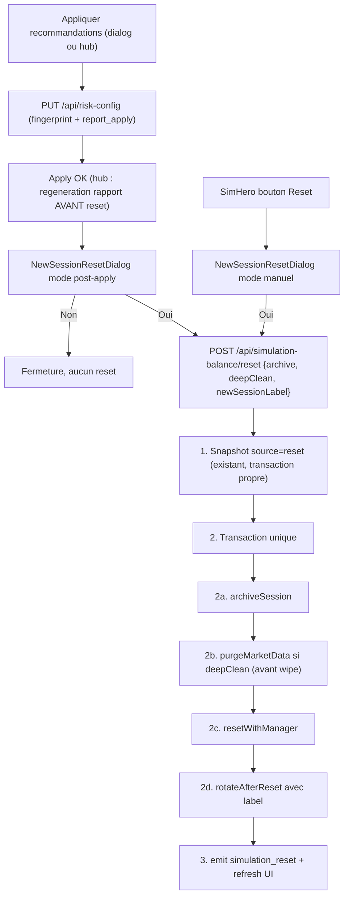

# Plan — Dialog nouvelle session post-recommandations + archivage avant reset

**Date** : 2026-07-11  
**Dernière mise à jour** : 2026-07-11  
**Statut** : Implémenté  
**Migration** : `AddSimSessionArchives1700000000049`  
**Tags** : `simulation`, `snapshots`, `sessions`, `archivage`, `crypto-algo`, `rapports`, `reset`  
**Références** :
- [`docs/snapshots-simulation.md`](../snapshots-simulation.md)
- [`docs/api.md`](../api.md)
- [`docs/modele-donnees.md`](../modele-donnees.md)

---

## Objectif

Après « Appliquer recommandations » d'un rapport crypto algo, proposer via un dialog de démarrer une nouvelle session snapshot avec reset complet de la simulation. Les données positions/marchés/métriques sont archivées dans des tables dédiées liées à la session close (ticks agrégés en bougies 1 min) avant purge optionnelle.

L'archivage s'applique à **tous** les resets (y compris le reset manuel SimHero).

---

## Constat actuel (avant implémentation)

- Un **seul** point d'entrée de reset : `POST /api/simulation-balance/reset` ([packages/backend/src/routes/simulation.ts](../../packages/backend/src/routes/simulation.ts)), appelé par `SimHero` via `resetSimulation()`.
- Flux legacy : snapshot `reset` → `SimulationService.reset()` (hard delete positions/exécutions/réservations sim) → `rotateAfterReset()`.
- Suppression **définitive** ; seul le JSON du snapshot conserve positions/exécutions. Données marché et `exit_attempt_events` ni archivées ni purgées.
- Apply recommandations sans lien avec sessions/reset.

---

## Décision : archivage sur tous les resets

- `archive: true` = **défaut du endpoint** (reset manuel et post-recommandations).
- `deepClean` = opt-in ; coché par défaut en mode post-apply (« base saine »), décoché en mode manuel.
- `window.confirm` SimHero remplacé par `NewSessionResetDialog` mode `manual`.

---

## Architecture cible



---

## Lot A — Core : migration, entités, service d'archivage

### A1. Migration `AddSimSessionArchives1700000000049`

Tables (toutes avec `session_id` + index) :

| Table | Contenu |
|-------|---------|
| `sim_archive_positions` | Positions sim + `raw_json` + `source_id` |
| `sim_archive_executions` | Exécutions sim |
| `sim_archive_exit_attempts` | `exit_attempt_events` (`mode = 'sim' OR NULL`, `created_at >= session.started_at`) |
| `sim_archive_surveillance` | `algo_surveillance_snapshots` |
| `sim_archive_price_candles` | Bougies OHLC 1 min (`algo` \| `market` \| `position`) |
| `simulation_sessions.archive_summary_json` | Compteurs + période |

Entités : `packages/core/src/entities/SimArchive*.ts`

### A2. Refactor `SimulationService.resetWithManager()`

Wrapper `reset()` inchangé pour les appelants legacy.

### A3. `SimulationResetArchiveService`

- `archiveSession(manager, session)` — copie positions/exécutions/exit attempts/surveillance + bougies
- `purgeMarketData(manager)` — purge sélective **avant** wipe
- `getArchive(sessionId, type, opts)` — lecture paginée API

**Conservés** : `move_events`, `trader_snapshots`, watchlist, `shadow_fills`, `clob_latency_samples`, `markets`, `algo_market_selections`.

### A4. `rotateAfterReset()` — option `newSessionLabel`

### A5. Tests

`packages/core/src/services/simulation-reset-archive.service.test.ts`

---

## Lot B — Backend

### B1. `POST /api/simulation-balance/reset`

```ts
{ amount?, archive?: true, deepClean?: false, newSessionLabel? }
```

Réponse : `{ ...snapshot, archiveSummary }`

### B2. `GET /api/simulation-sessions/:id/archive`

Query : `type=positions|executions|exit_attempts|surveillance|candles`, pagination.

### B3. Tests

`packages/backend/src/routes/simulation.reset.test.ts`

---

## Lot C — Frontend dialog et branchements

| Fichier | Rôle |
|---------|------|
| `NewSessionResetDialog.tsx` | Dialog reset (modes `post-apply` / `manual`) |
| `simulation.ts` | `resetSimulation({ archive, deepClean, newSessionLabel, amount })` |
| `CryptoAlgoOptimizeReportDialog.tsx` | Ouvre dialog après apply |
| `ReportsPage.tsx` | Apply → régénération rapport → dialog |
| `SimHero.tsx` | Reset manuel via dialog |

---

## Lot D — Viewer d'archive

| Fichier | Rôle |
|---------|------|
| `simulation-session-archive.ts` | Client API archive |
| `SimSessionArchiveDialog.tsx` | Dialog détail (onglets par type) |
| `SimulationSnapshotsPanel.tsx` | Bouton « Archive » sur sessions closes |
| `SimSessionCard.tsx` | Action archive |

---

## Lot E — Documentation

- [`docs/snapshots-simulation.md`](../snapshots-simulation.md) — section archivage
- [`docs/api.md`](../api.md) — routes reset + archive
- [`docs/modele-donnees.md`](../modele-donnees.md) — tables `sim_archive_*`

---

## Points de vigilance

- Archivage + purge + wipe + rotation dans **une seule transaction** (`resetWithManager`).
- Purge `market_position_ticks` **avant** delete positions sim (pas de colonne `mode` sur cette table).
- Purge `market_price_ticks` couplée au reset de `market_price_history_sync`.
- Ne **jamais** purger surveillance **live** (`close_captured_at IS NULL AND unresolved_at IS NULL`).
- `exit_attempt_events.mode` nullable → `mode = 'sim' OR mode IS NULL`.
- Workers concurrents : insertions post-transaction = nouvelle session (acceptable).
- Snapshot `reset` conservé : photo portefeuille ; archive = version requêtable.

---

## Écarts d'implémentation (vs plan initial)

| Plan | Implémenté |
|------|------------|
| Agrégation bougies SQL (`date_trunc`, `array_agg`) | Agrégation TypeScript (`archive-price-candles.ts`) — compatible tests pg-mem, volume session limité par cleanup 24 h |
| Archivage via `row_to_json` SQL | Copie TypeORM + `JSON.stringify` — même résultat fonctionnel |

## UI archives — hors scope v1

Consultation basique livrée (`SimSessionArchiveDialog`) ; **pas** d’interface de gestion complète (export, suppression ciblée des `sim_archive_*`, hub dédié, pagination UI). Voir [`docs/snapshots-simulation.md`](../snapshots-simulation.md) section « UI archives — périmètre actuel et évolutions possibles ».

---

## Fichiers principaux livrés

```
packages/core/src/migrations/AddSimSessionArchives1700000000049.ts
packages/core/src/services/simulation-reset-archive.service.ts
packages/core/src/simulation/archive-price-candles.ts
packages/backend/src/routes/simulation.ts (reset étendu + GET archive)
packages/frontend/src/components/NewSessionResetDialog.tsx
packages/frontend/src/components/SimSessionArchiveDialog.tsx
packages/frontend/src/lib/simulation-session-archive.ts
```
