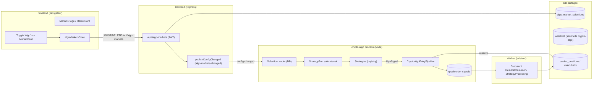

# crypto-algo — worker algorithmique sur marchés sélectionnés

## Contexte codebase

Polywatch est un monorepo npm-workspaces (core, backend, worker, frontend) partageant une DataSource TypeORM et un bus Redis. Un worker existe déjà (`packages/worker`) et sert de canonical template: boot DataSource, connexions Redis dédiées, `RedisQueue<T>` pour les queues, `safeInterval` pour les loops, `postBackendJson` vers `/api/internal/*` avec `X-Service-Token`.

Le pipeline d'exécution existant (à réutiliser tel quel) :
`ReservationService.reserve()` → `orderQueue.enqueue(OrderSignal)` → `Executor.handle()` (CLOB) → `ResultsConsumer` → `CopiedPosition`/`Execution` persistance → Socket.IO `emitPositionUpdate`/`emitExecution` vers le frontend.

Le frontend affiche déjà toute `CopiedPosition` quel que soit le `reason` ; pas de modification frontend nécessaire côté positions.

**Évolution clé vs v1** : crypto-algo ne découvre plus automatiquement tous les marchés Up/Down. L'utilisateur sélectionne explicitement les marchés à trader depuis la page marchés du frontend. La sélection est persistée en DB et synchronisée au worker via Redis pub/sub. La page marchés (`MarketsPage` / `MarketCard`) n'a aujourd'hui **aucun mécanisme de sélection** — seulement un bouton métriques. La `WatchlistEntry` est **trader-only** (`traderAddress`), incapable de référencer un `conditionId`.

## Architecture cible

crypto-algo n'a **pas** de consumer sur `order-signals` : il n'est que producteur. L'Executor existant dans `packages/worker` consomme la queue partagée et exécute l'ordre. Idem pour `close-signals` (géré par le worker). crypto-algo délègue donc entièrement l'exécution/SL-TP/exit au worker existant.

## Implémentations validées ✅

### 1. Core — entité `AlgoMarketSelection` + service + migration ✅

**Fichiers créés/modifiés :**
- `packages/core/src/entities/AlgoMarketSelection.ts` — entité avec `conditionId`, `question`, `cryptoSymbol`, `interval`, `slug`, `enabled`
- `packages/core/src/services/algo-market-selection.service.ts` — service CRUD + `disableResolved()`
- `packages/core/src/migrations/1700000000001-CreateAlgoMarketSelections.ts` — migration cross-dialect (SQLite/PostgreSQL)
- `packages/core/src/types/index.ts` — élargissement `OrderReason` → `'ALGO_OPEN' | 'ALGO_INCREASE'`
- `packages/core/src/services/reservation.service.ts` — support `ALGO_OPEN`/`ALGO_INCREASE` dans `REAL_ENTRY_REASONS`/`SIM_ENTRY_REASONS`, modification logique création position, defense-in-depth kill-switch
- `packages/core/src/idempotence/hash.ts` — `hashAlgoOrderSignalId()`
- `packages/core/src/entities/CopiedPosition.ts` — colonne `reason` (nullable)
- `packages/core/src/migrations/1700000000002-AddReasonToCopiedPositions.ts` — migration alter-table
- `packages/core/src/entities/RiskConfig.ts` — 6 champs crypto-algo (`cryptoAlgoEnabled`, `cryptoAlgoStrategies`, `cryptoAlgoSlPercent`, `cryptoAlgoTpPercent`, `cryptoAlgoTrailingStopPercent`, `cryptoAlgoTrailingActivationPercent`)
- `packages/core/src/migrations/1700000000003-AddCryptoAlgoRiskConfig.ts` — migration alter-table
- `packages/core/src/risk/crypto-algo-helpers.ts` — `getCryptoAlgoStrategies()`, `getCryptoAlgoExitParams()`
- `packages/core/src/entities/index.ts` — réexport `AlgoMarketSelection`
- `packages/core/src/services/index.ts` — réexport `AlgoMarketSelectionService`

### 2. Backend — router `/api/algo-markets` ✅

**Fichiers créés/modifiés :**
- `packages/backend/src/routes/algo-markets.ts` — router complet (GET/POST/DELETE/PATCH/status)
- `packages/backend/src/index.ts` — montage `/api/algo-markets`
- `packages/backend/src/routes/config.ts` — extension `riskConfigUpdateSchema` + `presentRiskConfigForApi`/`toRiskConfigEntityUpdate`
- `packages/backend/src/routes/positions.ts` — filtre `?reason=algo`

### 3. Frontend — store + toggle + page dédiée ✅

**Fichiers créés/modifiés :**
- `packages/frontend/src/stores/algoMarketsStore.ts` — signaux `selections`, `selectedConditionIds`, `isLoading` + fonctions CRUD
- `packages/frontend/src/components/MarketCard.tsx` — toggle "Algo" + badge
- `packages/frontend/src/components/MarketsPage.tsx` — hydratation `loadAlgoMarkets()`
- `packages/frontend/src/components/EnvSettingsDialog.tsx` — section crypto-algo (kill-switch, stratégies, SL/TP)
- `packages/frontend/src/components/CryptoAlgoPage.tsx` — page dédiée (statut process, tableau sélections, performances)
- `packages/frontend/src/components/DashboardNav.tsx` (ou router) — onglet "Crypto Algo"

### 4. Scaffold package `packages/crypto-algo` ✅

**Fichiers créés :**
- `packages/crypto-algo/package.json` — dépendances, scripts
- `packages/crypto-algo/tsconfig.json` — configuration TypeScript
- `packages/crypto-algo/src/config.ts` — configuration (DB, backend URL, poll interval)
- Root `package.json` — wiring scripts build/dev/test

### 5. SelectionLoader — chargement depuis DB ✅

**Fichier créé :**
- `packages/crypto-algo/src/selection-loader.ts` — charge `AlgoMarketSelection` depuis DB + refresh sur `config-changed` Redis

### 6. Interface Strategy extensible ✅

**Fichiers créés :**
- `packages/crypto-algo/src/strategy/strategy.ts` — interfaces `AlgoSignal`, `CryptoAlgoStrategy`, `StrategyContext`
- `packages/crypto-algo/src/strategy/registry.ts` — registry de stratégies + filtrage par ids activés
- `packages/crypto-algo/src/strategy/implementations/naive-momentum.strategy.ts` — stratégie placeholder

### 7. StrategyRunner — loop de décision ✅

**Fichier créé :**
- `packages/crypto-algo/src/strategy/strategy-run.ts` — boucle safeInterval + kill-switch + re-entry bornée + janitor auto-disable

### 8. CryptoAlgoEntryPipeline — prise de position ✅

**Fichier créé :**
- `packages/crypto-algo/src/processors/algo-entry-pipeline.ts` — pipeline complet (balances, sizing, reserve, enqueue)

### 9. Watchlist sentinelle crypto-algo ✅

**Fichier créé :**
- `packages/crypto-algo/src/watchlist-seed.ts` — seed idempotent `WatchlistEntry` avec `traderAddress: 'crypto-algo'`

### 10. StubConnectionManager ✅

**Fichier créé :**
- `packages/crypto-algo/src/stub-connection-manager.ts` — stub temporaire pour `IPolymarketConnectionManager` (à remplacer par le vrai WS)

### 11. index.ts — bootstrap du process ✅

**Fichier créé :**
- `packages/crypto-algo/src/index.ts` — bootstrap complet (DataSource, Redis, WS, heartbeat, config-changed, loops, shutdown)

### 12. Extraction modules partagés vers `@polywatch/core` ✅

**Fichiers créés/modifiés :**
- `packages/core/src/worker-shared/safe-interval.ts` — `safeInterval`, `sleep`
- `packages/core/src/worker-shared/redis-queue.ts` — `RedisQueue` + dead-letter
- `packages/core/src/worker-shared/backend-readiness.ts` — `waitForBackendReady`, `parseBackendReadyPayload`
- `packages/core/src/worker-shared/backend-client.ts` — `createBackendClient`, `postBackendJson`
- `packages/core/src/worker-shared/connection-manager-interface.ts` — `IPolymarketConnectionManager` (type-only)
- `packages/core/package.json` — subpath exports pour tous les modules worker-shared
- `packages/core/src/index.ts` — barrel exports
- Packages serveur (worker, backend, crypto-algo) — imports mis à jour vers `@polywatch/core/worker-shared/*`

---

## Éléments restants à implémenter

### 1. Remplacer `StubConnectionManager` par vrai `PolymarketConnectionManager`

Le stub actuel ne fournit pas de vrais prix exécutables. Le vrai `PolymarketConnectionManager` (dans `packages/worker/src/polymarket/connection-manager.ts`) gère :
- WebSocket order books (market channel)
- `fetchExecutablePrices(assetId, qty)` — VWAP réel
- `pendingMoveAssets` cache
- Circuit breaker + rate limiter

**Problème** : `PolymarketConnectionManager` a une chaîne de dépendances lourde (websocket-book, circuit-breaker, rate-limited-fetch, token-bucket, market-metrics-cache). Deux options :

**Option A — Extraction complète vers core** :
- Déplacer toute la chaîne vers `@polywatch/core/src/polymarket/`
- Worker et crypto-algo importent depuis core
- Avantage : pas de duplication, maintenance centralisée
- Inconvénient : refactor important du worker

**Option B — Duplication partielle dans crypto-algo** :
- Créer `packages/crypto-algo/src/connection-manager.ts` avec uniquement WS books + `fetchExecutablePrices`
- Garder le worker inchangé
- Avantage : impact minimal sur le worker existant
- Inconvénient : duplication de code

**Recommandation** : Option A (extraction complète) pour maintenabilité long terme.

### 2. Wirer `fetchAvailableRealCash` pour le mode real

Actuellement `fetchAvailableRealCash()` n'est pas appelé dans l'entry pipeline. Le mode real utilise `availableCash: undefined` → le sizing retourne `null` et aucune position real n'est créée.

**Implémentation nécessaire** :
- Ajouter `fetchAvailableRealCash(dataSource)` dans crypto-algo
- Appeler depuis `CryptoAlgoEntryPipeline.run()` quand `mode === 'real'`
- Passer le cash disponible au sizing

### 3. Rendre `outcomePrices` disponibles dans le `StrategyRunner`

`MarketListItemDto.outcomePrices` est vide (`[]`) dans le plan actuel. La stratégie `naive-momentum` a besoin du prix YES/NO courant pour décider.

**Implémentation nécessaire** :
- Dans `StrategyRunner.tick()`, charger `MarketListItemDto` complet avec `outcomePrices`
- Soit via `MarketService.fetchAndPersist()` (qui peuple `outcomePrices`)
- Soit via un appel direct à l'API Gamma
- Passer `outcomePrices` au contexte de la stratégie

### 4. Tests unitaires

Le nouveau package `@polywatch/crypto-algo` n'a pas de tests.

**Tests nécessaires** :
- `AlgoMarketSelectionService` — CRUD, `disableResolved()`
- `StrategyRegistry` — filtrage par ids activés
- `naive-momentum.strategy.ts` — logique de décision
- `StrategyRun` — kill-switch, re-entry counter, janitor
- `CryptoAlgoEntryPipeline` — reserve + enqueue (mock)

---

## Décisions d'implémentation (tranchées)

### Décisions initiales
- **Mode d'exécution** : sim ET real (deux positions distinctes par signal si `realTradingEnabled`, comme le copy-pipeline qui boucle sur chaque mode).
- **Configuration des stratégies** : via `RiskConfig.cryptoAlgoStrategies` en DB (JSON array d'ids), éditable dans `EnvSettingsDialog`. Pas d'env. Le runner recharge à chaque `config-changed`.

### Résolutions des zones d'ombre

**1. Partage de code worker → crypto-algo : extraction vers `@polywatch/core`** ✅
Les modules partagés ont été extraits vers `@polywatch/core/src/worker-shared/` :
- `safeInterval`, `sleep`
- `RedisQueue` (avec dead-letter)
- `waitForBackendReady`, `parseBackendReadyPayload`
- `createBackendClient`, `postBackendJson`
- `IPolymarketConnectionManager` (interface type-only)

**Note** : `PolymarketConnectionManager` (implémentation complète avec WS books) n'a PAS été extrait — reste dans le worker. Voir "Éléments restants" point 1.

**2. SL/TP : champs dédiés dans `RiskConfig`** ✅
crypto-algo a ses propres paramètres de sortie séparés du copy-trading : `cryptoAlgoSlPercent`, `cryptoAlgoTpPercent`, `cryptoAlgoTrailingStopPercent`, `cryptoAlgoTrailingActivationPercent` (colonnes `RiskConfig`, éditables dans `EnvSettingsDialog`). Récupérés via `getCryptoAlgoExitParams(risk)`.

**3. Mapping outcome → assetId : configurable par signal** ✅
La stratégie retourne `outcome: 'YES' | 'NO'` ET `assetId` directement dans `AlgoSignal`. La stratégie est responsable du mapping : elle lit `Market.tokenIdYes`/`tokenIdNo` et choisit l'assetId selon sa logique.

**4. Subscriptions WS order books : répliquer `syncBookSubscriptions`** — À FAIRE
crypto-algo doit maintenir ses propres subscriptions via une instance dédiée de `PolymarketConnectionManager` + `syncBookSubscriptions`. Actuellement un stub est en place.

**5. Mode effectif : deux positions (sim + real si activé)** ✅
crypto-algo génère un `OrderSignal` par mode activé. Si `realTradingEnabled === false`, seulement `sim`. Si `true`, sim ET real (deux appels `reserve` + `enqueue` séparés). Le pipeline itère sur `['sim', 'real']` filtré par `realTradingEnabled`.

**6. Nettoyage de la sélection : auto-disable automatique** ✅
Un janitor `safeInterval` (60s) appelle `AlgoMarketSelectionService.disableResolved()` : pour chaque sélection active, vérifie si le `Market` est `resolved === true` ou `closed === true` ou `endDate passé` → passe `enabled = false`.

**7. Re-entry : max N positions par marché par fenêtre** ✅
Le debounce est un compteur `Map<conditionId, { windowStart, count }>`. Une nouvelle entrée est autorisée tant que `count < MAX_ENTRIES_PER_WINDOW` (constante configurable, défaut 1). Le compteur se reset au changement de fenêtre.

---

## Architecture des imports (post-refactor)

Pour éviter les erreurs runtime frontend (`node:fs` externalized), les imports sont maintenant :

| Package | Import path | Contenu |
|---|---|---|
| Frontend | `@polywatch/core/market-list` | Types `MarketListItemDto`, `isMarketActive`, `MarketPercentUpdate`, `MarketTick`, `MarketMetricsDto` (pas de Node.js modules) |
| Backend/Worker/Crypto-algo | `@polywatch/core` | Barrel complet (tous les exports serveur) |
| Backend/Worker/Crypto-algo | `@polywatch/core/config/env` | `loadMonorepoEnv`, `getDatabasePath`, `getDatabaseUrl` (Node.js seulement) |
| Backend/Worker/Crypto-algo | `@polywatch/core/config/secrets` | `assertSecureSecret`, `validateProductionSecrets` (Node.js seulement) |

---

## Todos originaux (tous validés ✅)

1. ✅ **extract-shared-core** : Extraire vers `@polywatch/core` : `safeInterval`, `RedisQueue`, `waitForBackendReady`, `createBackendClient`, `IPolymarketConnectionManager` (interface only)
2. ✅ **core-selection** : Entité `AlgoMarketSelection` + service + migration + `OrderReason`/`ReserveInput.reason` + colonne `CopiedPosition.reason` + `hashAlgoOrderSignalId` + `RiskConfig` champs crypto-algo
3. ✅ **backend-routes** : Router `/api/algo-markets` + extension config + filtre `reason=algo`
4. ✅ **frontend-store** : Store + toggle `MarketCard` + section `EnvSettingsDialog` + page `CryptoAlgoPage` + navigation
5. ✅ **scaffold-package** : Scaffold `packages/crypto-algo`
6. ✅ **selection-loader** : `SelectionLoader` + refresh Redis
7. ✅ **strategy-iface** : Interface `CryptoAlgoStrategy` + registry + impl `naive-momentum`
8. ✅ **strategy-runner** : `StrategyRunner` + kill-switch + re-entry + janitor
9. ✅ **entry-pipeline** : `CryptoAlgoEntryPipeline` + reserve + enqueue
10. ✅ **watchlist-seed** : Seed `WatchlistEntry` crypto-algo
11. ✅ **index-bootstrap** : Bootstrap complet (DataSource, Redis, WS, heartbeat, loops, shutdown)