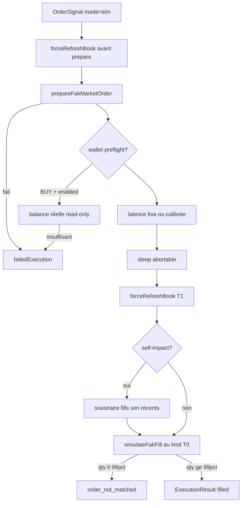

# Exécution simulation — réalisme configurable

Ce document décrit le pipeline d’exécution en mode **sim** et les réglages disponibles pour le rapprocher du trading **réel** sans poster d’ordre au CLOB.

## Pipeline

1. **Refresh REST puis pré-ordre partagé** — `forceRefreshBook` puis `prepareFakMarketOrder`, identique au réel avant `POST /order` : VWAP, slippage, tick, resserrement SELL `lastTradePrice`, MOS, hold-if-winning. Même snapshot book que le réel au prepare.
2. **Préflight wallet** (optionnel) — BUY sim : vérifie la balance réelle si credentials CLOB présents ; sinon ignoré.
3. **Latence** — délai avant match (fixe ou tiré des RTT réels).
4. **Book T1** — `forceRefreshBook` (REST, ignore le cache).
5. **Auto-impact** (optionnel) — soustrait la profondeur consommée par les fills sim récents (TTL configurable).
6. **FAK local** — `simulateFakFill` au `limitPrice` figé en T0 ; BUY utilise le montant collatéral arrondi comme le réel.
7. **Échec T1** (carnet vide, asks/bids qui ne croisent pas le limit, ou fill < 99 % de la quantité) → `order_not_matched` (pas `no_liquidity`, pas de fill partiel fantôme). Aligné sur le parse live (`no orders found to match with fak` / `couldn't be fully filled`).

## Réglages (`GlobalConfig`)

Configurable via **Simulation → Exécution sim** (`SimExecutionSettingsDialog`).
Résolus par `resolveSimExecutionTunables` (`packages/core/src/risk/sim-execution-tunables.ts`).

| Champ | Défaut (null) | Rôle |
|-------|---------------|------|
| `simExecLatencyMode` | `fixed` | `fixed` ou `calibrated` (RTT réels) |
| `simExecLatencyMs` | env / 150 | Latence fixe (ms) ; `0` = pas de sleep |
| `simSelfImpactEnabled` | `false` | Auto-impact liquidité |
| `simSelfImpactTtlSeconds` | 8 | TTL consommation profondeur (s) |
| `simWalletPreflightEnabled` | `false` | Préflight balance BUY |
| `simShadowLoggingEnabled` | `false` | Compare fills réels vs FAK local |
| `shadowSampleRetentionDays` | 14 | Rétention tables `clob_latency_samples` / `shadow_fills` |

Env de secours : `SIM_EXECUTION_LATENCY_MS` (CI / override).

## Shadow logging & calibration

Quand le trading **réel** est actif :

- Chaque `createAndPostMarketOrder` peut enregistrer un **RTT** (`clob_latency_samples`) si mode calibré ou shadow activé.
- Chaque fill réel peut enregistrer un **shadow fill** (`shadow_fills`) : comparaison prix/qty réel vs FAK local au même limit.

Stats live : `GET /sim-execution-stats` (p50/p90 RTT, nombre de shadows, écarts moyens).

## Limites résiduelles vs réel

- Pas de POST CLOB → pas de course matcher authentique, rejets API signés, états `delayed`.
- Auto-impact en mémoire (perdu au restart worker).
- Latence calibrée nécessite ≥ 10 ordres réels récents.
- MOS sim : book public ; réel : `getClobMarketInfo` authentifié.

## Nettoyage des données de réalisme (`SimRealismJanitor`)

`packages/worker/src/watchdogs/sim-realism-janitor.ts`

Le `SimRealismJanitor` est un watchdog du worker qui nettoie périodiquement les
données de réalisme de simulation :

- **Latency samples** (`clob_latency_samples`) : purge des échantillons RTT
  plus vieux que `shadowSampleRetentionDays` (défaut 14 jours).
- **Shadow fills** (`shadow_fills`) : purge des shadow fills plus vieux que
  `shadowSampleRetentionDays`.
- Exécuté au démarrage du worker et à intervalle régulier.

Ces données sont produites par le `LatencyCalibrator` et le `ShadowFillRecorder`
quand le trading réel est actif et que le shadow logging ou le mode calibré
est activé.

## Fichiers clés

| Module | Chemin |
|--------|--------|
| Pré-ordre | `packages/worker/src/clob/prepare-fak-order.ts` |
| Sim fill | `packages/worker/src/processors/executor.ts` |
| Latence | `packages/worker/src/execution/latency-calibrator.ts` |
| Auto-impact | `packages/worker/src/execution/self-impact-registry.ts` |
| Shadow | `packages/worker/src/execution/shadow-fill-recorder.ts` |
| Tunables | `packages/core/src/risk/sim-execution-tunables.ts` |
| UI | `packages/frontend/src/components/SimExecutionSettingsDialog.tsx` |
