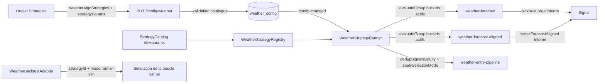

# Plan — Multi-stratégies Weather Algo (extensible, v2)

**Date** : 2026-08-09
**Statut** : Plan validé, **partiellement implémenté** (2026-08-09)
**Références** : [`2026-08-09_audit-weather-algo-strategy-live.md`](./2026-08-09_audit-weather-algo-strategy-live.md) · [`../strategies-audit/2026-08-08_SPEC_multi-strategy-weather-algo.md`](../strategies-audit/2026-08-08_SPEC_multi-strategy-weather-algo.md)

### Livré vs ouvert

| Item | État |
|---|---|
| Catalogue core + `evaluateGroup` + 2 stratégies (best-edge / aligned) | ✅ |
| Runner first-wins (ordre **catalogue**), safe reload snapshot, `activeStrategies` | ✅ |
| Config DB + validation backend + onglet UI Stratégies | ✅ |
| Backtest `strategy` / `runner-sim` + UI | ✅ |
| Params déclaratifs par stratégie | ✅ schéma prêt ; catalogue actuel = `params: []` (gates = knobs globaux) |
| Badge UI `strategyId` sur positions / exécutions | ❌ ouvert |
| Tests dédiés safe-reload + E2E `activeStrategies` | ❌ ouvert |
| `runner-sim` multi-stratégies (sans forcer un seul `strategyId`) | ❌ ouvert (UI passe toujours `strategyId`) |
| SPEC spread / convergence / arbitrage | ❌ futur (hors cette étape) |

---

## Choix validés

- **2 stratégies** : `weather-forecast` (best-edge, live actuel) + `weather-forecast-aligned` (doc `selectForecastAlignedBucket`)
- **UI** : nouvel onglet "Stratégies" dédié dans la page Weather Algo
- **Extensibilité** : catalogue de stratégies + params déclaratifs par stratégie (JSON `weather_algo_strategy_params`)

---

## Principes corrigés (audit du plan v1)

1. **La stratégie choisit son bucket**, pas le runner. Le runner livre un groupe de buckets actifs et collecte le signal.
2. **Interface groupe** : ajout de `evaluateGroup?(buckets, ctx)` à `WeatherStrategy`; fallback `evaluate` par bucket conservé.
3. **Params validés** : le catalogue déclare un schéma par stratégie (clé, type, bornes, défaut). Backend + runner valident/mergent contre ce schéma.
4. **Backtest** : deux modes explicites — `strategy` (pur, rapide) et `runner-sim` (reproduit la sélection runner). Comparaison des stratégies = `runner-sim`.
5. **Traçabilité** : `strategyId` sur chaque signal / eval log + `activeStrategies` dans runtime-status + badge UI sur positions.
6. **Reload config safe** : un cycle en cours finit avec l'ancienne config ; la nouvelle stratégie s'applique au prochain tick (pas de mélange).

---

## Architecture cible

---

## Étapes

### 1. Catalogue + interface + schéma de params

- `packages/core/src/weather/strategy-catalog.ts` (nouveau) :
  - `WEATHER_STRATEGY_CATALOG: WeatherStrategyMeta[]` ordonné (`id`, `label`, `description`, `supportsGroup`, `params: StrategyParamSchema[]`).
  - `StrategyParamSchema = { key, label, kind: 'number'|'boolean'|'select', min?, max?, step?, options?, default }`.
  - `getStrategyParams(config: WeatherConfig, id: string)` — merge défauts catalogue + `weatherAlgoStrategyParams`, ignore clés inconnues.
  - **C'est une lib partagée, pas un service** : backend, weather-algo et backtest l'importent tous depuis `@polywatch/core`. Aucun processus supplémentaire.
- `packages/weather-algo/src/strategy/strategy.ts` :
  - Ajouter `evaluateGroup?(buckets: MarketListItemDto[], ctx, now?): Promise<WeatherEvaluationResult>` optionnel.
  - Documenter : si `evaluateGroup` absent, le runner boucle sur `evaluate` par bucket (comportement legacy).
- Exporter le catalogue via `packages/core/src/weather/index.ts` (ou `packages/core/src/index.ts`) pour les consommateurs.

### 2. Stratégies

- `packages/weather-algo/src/strategy/weather-forecast.strategy.ts` :
  - Implémenter `evaluateGroup` : appelle `evaluate` sur chaque bucket actif, collecte les signaux, retourne `pickBestEdgeBucket` (déplacé depuis le runner vers cette stratégie ou un helper partagé).
  - Corriger le JSDoc (plus « forecast-aligned »).
- `packages/weather-algo/src/strategy/weather-forecast-aligned.strategy.ts` (nouveau) :
  - Implémente `evaluateGroup` : `selectForecastAlignedBucket(forecastMean, buckets)` puis `evaluate` uniquement sur ce bucket.
  - Réutilise le même gate edge / probabilité via helper partagé `evaluateBucketGate` extrait de `weather-forecast.strategy.ts`.
- `registry.ts` : enregistrer les 2 stratégies au boot (ordre du catalogue = priorité first-wins).

### 3. Runner (groupe-level + safe reload)

- `packages/weather-algo/src/strategy/strategy-runner.ts` :
  - `evaluateCityFollowRules` : lire `enabledStrategies` depuis `risk.weatherAlgoStrategies` (défaut `["weather-forecast"]`), filtrer `registry.getAll()`.
  - `evaluateCityFollowDateGroup` : pour chaque stratégie active, appeler `evaluateGroup(activeBuckets.map(b=>b.market), ctx)` si dispo, sinon boucle `evaluate`. Retourner le premier signal non-null (ordre catalogue).
  - Supprimer `pickBestEdgeBucket` du runner (déplacé dans la stratégie). Garder `dedupSignalsByCity` et `applySelectionMode` inchangés.
  - **Safe reload** : stocker `enabledStrategies` au début du cycle dans une variable locale ; ne pas relire `this.risk` au milieu d'un cycle.
  - Runtime status : ajouter `activeStrategies: string[]`.
- Eval log : s'assurer que `strategy_id` enregistré = stratégie qui a réellement émis (pas la première du catalogue si abstention).

### 4. Config + DB + backend

- `packages/core/src/entities/WeatherConfig.ts` :
  - `weather_algo_strategies` text JSON, défaut `'["weather-forecast"]'`.
  - `weather_algo_strategy_params` text JSON, défaut `'{}'`.
- Migration `AddWeatherAlgoStrategies1700000000102.ts` (créer les 2 colonnes).
- `packages/core/src/risk/weather-config-api.ts` : parse/serialize `weatherAlgoStrategies` (string[]) et `weatherAlgoStrategyParams` (objet). Pattern identique à `parseAllowedMarketTags`.
- `packages/backend/src/routes/config-per-kind.ts` :
  - Schéma zod : `weatherAlgoStrategies: z.array(z.enum(catalogIds)).min(1)`, `weatherAlgoStrategyParams: z.record(z.string(), z.record(z.string(), z.union([z.number(), z.boolean(), z.string()])))`.
  - Validation métier : IDs présents dans le catalogue importé de `@polywatch/core` (pas de dépendance backend → weather-algo).
  - Valider chaque param contre le schéma déclaré dans le catalogue (bornes min/max).
- Vérifier qu'il n'existe pas de route weather settings séparée (`weather-algo-settings.ts`) qui écrirait la même config — si oui, l'aligner ou la supprimer.

### 5. UI onglet Stratégies

- `packages/frontend/src/lib/ui-persistence.ts` : ajouter `'strategies'` à la liste des tabs weather-algo.
- `packages/frontend/src/components/WeatherAlgoPage.tsx` : nouveau tab + lazy `WeatherAlgoStrategiesTab`.
- `packages/frontend/src/components/WeatherAlgoStrategiesTab.tsx` (nouveau) :
  - Fetch `GET /api/weather-algo/strategy-catalog` (nouvelle route légère backend qui sert le catalogue) ou constante partagée si couplage acceptable. Recommandation : route catalogue pour éviter duplication des schémas.
  - Checkbox group (ordre d'affichage = catalogue). Priorité first-wins = **ordre catalogue**, pas l'ordre du JSON. Persister `weatherAlgoStrategies`.
  - Pour chaque stratégie cochée : section params générée depuis `params` du catalogue (number / boolean / select). Valeurs dans `weatherAlgoStrategyParams[strategyId]`, défaut = schéma. (Catalogue v1 : `params: []`.)
  - Badge « active » sur les positions / exécutions via `strategyId` — **pas encore livré**.
- `packages/frontend/src/api.ts` : étendre `WeatherConfig` avec les 2 champs.
- Copier le pattern de `crypto-algo-settings-types.ts` pour typer les params côté frontend.

### 6. Backtest

- `packages/backtest/src/adapters/weather/weather-adapter.ts` :
  - Constructor : factory `createWeatherStrategy(strategyId, clock)` — instancie la stratégie demandée (ou défaut `weather-forecast`).
  - Ajouter `params.backtestExecutionMode: 'strategy' | 'runner-sim'` (défaut `'strategy'` pour perf).
  - En `runner-sim` : simuler la boucle runner par ville/date (regrouper ticks par city/date, appeler `evaluateGroup`, appliquer `dedupSignalsByCity`, `applySelectionMode`, `hasOpenCity`, re-entry throttle). Réutiliser les helpers exportés du package weather-algo pour éviter divergence.
  - En `strategy` : comportement actuel par tick (documenté comme non équivalent live).
- `packages/backtest/src/adapters/weather/params.ts` : ajouter `strategyId` (déjà là) + `backtestExecutionMode`.
- `data-loader.ts` : replay garde le filtre `strategyId` existant.

### 7. Docs + tests

- `docs/weather-algo.md` : corriger la section stratégie (best-edge vs aligned, catalogue, onglet Stratégies).
- `docs/code/08-weather-algo.md` : décrire `evaluateGroup`, catalogue, params dynamiques, backtest modes.
- `docs/strategies-audit/2026-08-08_SPEC_multi-strategy-weather-algo.md` : marquer comme partiellement implémenté (étape 1 = forecast best-edge/aligned ; spread/convergence/arbitrage = future).
- JSDoc de `weather-forecast.strategy.ts` corrigé.

---

## Fichiers principaux

- **Nouveau** : `core/weather/strategy-catalog.ts`, `weather-forecast-aligned.strategy.ts`, `AddWeatherAlgoStrategies1700000000102.ts`, `WeatherAlgoStrategiesTab.tsx`, route `weather-algo/strategy-catalog.ts`
- **Modifié** : `strategy.ts`, `registry.ts`, `strategy-runner.ts`, `weather-forecast.strategy.ts`, `WeatherConfig.ts`, `weather-config-api.ts`, `config-per-kind.ts`, `WeatherAlgoPage.tsx`, `ui-persistence.ts`, `api.ts`, `weather-adapter.ts`, `params.ts`, docs

---

## Tests

- **Unit** : `weather-forecast-aligned` (bucket filtré + gate), `weather-forecast.evaluateGroup` (best-edge), `getStrategyParams` (merge + défauts), runner filtre `weatherAlgoStrategies`, safe reload (cycle fini avec ancienne config).
- **Intégration backtest** : `runner-sim` avec `weather-forecast-aligned` produit des positions différentes de `weather-forecast` ; `strategy` mode documenté comme non équivalent.
- **E2E light** : UI toggle → PUT config → GET runtime status montre `activeStrategies`.

---

## Risques / décisions

- **Priorité multi-stratégies** : first-wins dans l'ordre du catalogue. Documenté dans l'UI.
- **Rétrocompat** : défaut `["weather-forecast"]` = live actuel inchangé. Le runner délègue maintenant le choix de bucket à la stratégie, mais le résultat pour `weather-forecast` seul doit être bit-identique (test de régression).
- **Params JSON** : validation catalogue côté backend obligatoire ; sinon risque de config silencieusement ignorée.
- **Dépendance backend → catalogue** : résolu — catalogue dans `@polywatch/core` (`core/weather/strategy-catalog.ts`), importé par backend, weather-algo et backtest. Aucun processus séparé, juste une lib partagée.
