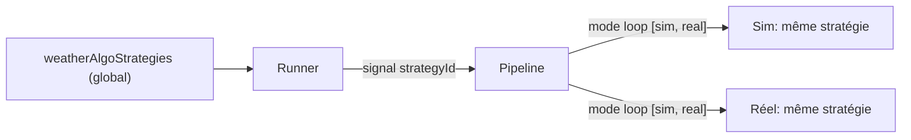
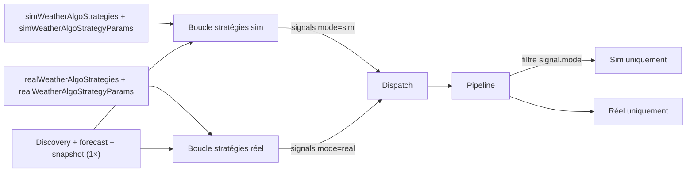

# Plan — Stratégies Weather Algo par environnement (sim/réel)

**Date** : 2026-08-27  
**Statut** : Plan validé, **implémenté** (étapes 1–12 ✅)  
**Références** : [`2026-08-09_PLAN-weather-multi-strategy-extensible.md`](./2026-08-09_PLAN-weather-multi-strategy-extensible.md) · [`2026-08-11_PLAN-weather-per-strategy-config.md`](./2026-08-11_PLAN-weather-per-strategy-config.md) · [`../../reference/weather-algo.md`](../../reference/weather-algo.md) · [`../../code/08-weather-algo.md`](../../code/08-weather-algo.md) · [`../../reference/backtest.md`](../../reference/backtest.md)  
**Objectif** : Chaque environnement (simulation / réel) exécute sa propre stratégie active, avec ses propres paramètres, sur les marchés en live.

### Checklist d'implémentation

| # | Étape | Statut |
|---|-------|--------|
| 1 | Entité `WeatherConfig` + `WeatherEvaluationLog` + migration 0121 + `data-source.ts` + backfill | ✅ |
| 2 | API config (Omit raw + strip legacy) + helpers `ForMode` (fallback raw) + policy / exit-params / reentry-after-sl + exports core | ✅ |
| 3 | Runner : discovery/snapshot **une fois** + boucle stratégies × 2 modes + capacité `city\|date\|strategy\|mode` aux 3 sites + 2 registres + runtime-status | ✅ |
| 4 | `WeatherSignal.mode` + `WeatherEvaluationContext.mode` + stamp dans `evaluate-bucket-gate.ts` + highest-yes | ✅ |
| 5 | Evaluation log colonne `mode` (entité + recorder + runner + route + UI DataTab) | ✅ |
| 6 | Entry pipeline (filtre mode) + exit evaluator (mode depuis position) | ✅ |
| 7 | Kill-switch par mode (pas d'union sim+real) + `getStrategyParamsForMode` | ✅ |
| 8 | PUT `/config/weather` (4 champs sanitizés, legacy acceptés **retirés** du patch, schema strict) + backtest-dto `strategyEnv` | ✅ |
| 9 | Backtest `strategyEnv` (pas `mode`) + `applyConfigOverrides` mapping + weather-adapter/exit-manager + UI backtest | ✅ |
| 10 | Frontend types + StrategiesTab scindé + CapitalHero + **WeatherAlgoPage** câblage + dashboard hook + DataTab mode | ✅ |
| 11 | Tests unit + E2E + entry-pipeline + fixtures `ctx.mode` / `signal.mode` + helpers risk-config + runner-sim + backtest-dto | ✅ |
| 12 | Documentation (`weather-algo.md`, `08-weather-algo.md`, `configuration.md`, `api.md`, `backtest.md`) | ✅ |

---

## Contexte actuel

Un seul champ global `weatherAlgoStrategies` (JSON array) + `weatherAlgoStrategyParams` (JSON map) pilotent **les deux** modes. Le runner évalue les stratégies une fois, produit des signaux portant `strategyId`, et l'entry-pipeline exécute le même signal en sim ET réel (filtré uniquement par `weatherAlgoSimEnabled` / `weatherAlgoRealEnabled`).

La capacité ville+date est mixte (sim et réel partagent le même compteur `city|date|strategyId`). `loadOpenWeatherCityDates` et la garde dans `evaluateCityFollowDateGroup` utilisent cette clé **sans** `mode`.



## Architecture cible



## Décisions de conception (validées)

1. **Colonnes séparées** (pas un JSON imbriqué) : `sim_weather_algo_strategies`, `real_weather_algo_strategies`, `sim_weather_algo_strategy_params`, `real_weather_algo_strategy_params`. Miroir du pattern existant `weatherAlgoSimEnabled` / `weatherAlgoRealEnabled`. **Colonnes legacy** : `weather_algo_strategies` et `weather_algo_strategy_params` sont conservées en lecture seule (fallback pour rétrocompatibilité et replay des anciens snapshots backtest), **plus écrites** après migration. La migration backfill copie l'ancienne valeur dans les 4 nouvelles colonnes. Les helpers `resolveEnabledWeatherStrategiesForMode` / `getStrategyParamsForMode` lisent les nouvelles colonnes et fallback sur l'ancienne si vide. Le backend `PUT /config/weather` persiste les 4 nouveaux champs ; les champs legacy restent acceptés (optionnels dépréciés) mais **retirés du patch** (jamais passés à `updateConfig`).

2. **Signal porte `mode`** : `WeatherSignal` gagne un champ `mode: TradingMode` (`'sim' | 'real'`, déjà exporté depuis `packages/core/src/types/index.ts`). Le runner évalue les stratégies sim et réel séparément, tagge chaque signal, et l'entry-pipeline saute les modes non matchants. Le stamp se fait depuis `WeatherEvaluationContext.mode` : pour forecast / aligned via **`evaluate-bucket-gate.ts`** (constructeur réel du signal), pour highest-yes dans la stratégie elle-même.

3. **Runner = discovery/snapshot une fois, boucle stratégies × 2 modes, dispatch parallèle** :
   - **Partagé (1× par cycle)** : exits, discovery marchés, fetch forecast, `loadOpenWeatherCityDates`, enregistrement market snapshot / forecast history.
   - **Par mode** : résolution des stratégies, `evaluate` / `evaluateGroup`, evaluation logs, dedup, sélection, capacité.
   - Relancer `evaluateCityFollowDateGroup` une fois par mode **dupliquerait les snapshots** — interdit. La fonction prend les deux listes de stratégies (ou un map mode → stratégies) et n'enregistre le snapshot qu'**avant** les deux boucles.
   - Dispatch : `Promise.all` des deux lots (sim vs real). Intra-lot, `onSignal` **séquentiel**. Les stratégies communes aux deux modes sont réévaluées (≤3 × 2, acceptable).
   - Skipper la boucle stratégies d'un mode si `!weatherAlgoSimEnabled` / `!weatherAlgoRealEnabled` (pas d'eval logs ni de signaux pour un env off). Les sorties restent globales via l'exit evaluator, **avant** les passes d'entrée.

4. **2 instances de stratégie par registre** (choix utilisateur) : le runner dispose de **2 registres** — `registrySim` et `registryReal` — chacun instanciant ses propres stratégies avec ses propres bags. Cela isole complètement les états internes (pas de `setActiveMode` partagé). Le registry sim reçoit les params sim via `setRiskConfig(getStrategyParamsForMode(risk, id, 'sim'))`, le registry real les params real. `setRiskConfig` conserve sa signature `(bag: WeatherStrategyParamsBag)` — pas de changement d'interface stratégie.

5. **Exit evaluator lit le mode de la position** : déjà mode-aware via `pos.mode` (colonne existante `CopiedPosition.mode`, `text` NOT NULL) et `snapshot.strategyId`. Le seul changement est `getStrategyParamsForMode` qui lit la map de params du bon environnement (dérivé de `pos.mode`). Fallback TypeScript `pos.mode ?? 'sim'` par prudence.

6. **Evaluation log : garder + ajouter colonne `mode`** (choix utilisateur) : `WeatherEvaluationLog` gagne une colonne `mode` (`text`, défaut `'sim'`) pour distinguer les évaluations des deux passes. Les lignes **historiques** seront toutes étiquetées `'sim'` (DEFAULT SQL) — le filtre UI « réel » les masque ; documenter ce biais. La suppression totale des logs d'évaluation est un travail séparé (hors périmètre).

7. **Backtest : sélecteur d'environnement de stratégie** (choix utilisateur) : le formulaire de lancement gagne un sélecteur Sim/Réel. **Ne pas réutiliser le champ `mode`** — `BacktestRunParams.mode` vaut déjà `'reevaluate'`. Nouveau champ : `strategyEnv: 'sim' | 'real'` (défaut `'sim'`). `createRunnerSimStrategies` lit `resolveEnabledWeatherStrategiesForMode(config, strategyEnv)`. **Pas de bump** `BACKTEST_ENGINE_VERSION` (0.8.0) : paramètre additif, les anciens snapshots sans les 4 colonnes retombent sur le legacy via le fallback raw.

8. **Dispatch parallèle = entre modes, pas intra-mode** : `Promise.all` des deux lots. À l'intérieur d'un lot, `onSignal` **séquentiel** (évite une course sur cash sim / réservations réel). Deux fetches CLOB concurrentes (sim + réel sur le même book) sont acceptées.

9. **Capacité découplée par mode (changement de comportement, voulu)** : la clé devient `${city}|${date}|${strategyId}|${mode}` aux **trois** sites (`loadOpenWeatherCityDates`, garde batch dans `runEvaluationCycle`, garde dans `evaluateCityFollowDateGroup`). Sim et réel peuvent chacun tenir `maxPositionsPerCityDate` sur la même ville+date (aujourd'hui ils partagent le compteur). Dedup / sélection s'appliquent **dans** chaque passe, pas après concaténation.

10. **GET legacy = figé, UI live ne le lit plus** : `presentWeatherConfigForApi` continue de parser `weatherAlgoStrategies` / `weatherAlgoStrategyParams` (colonnes gelées au backfill) pour ne pas casser un client typé. L'UI live (StrategiesTab, CapitalHero, BacktestTab) lit **uniquement** `sim*` / `real*`. Ne pas synthétiser le legacy depuis sim (mentirait après divergence).

11. **Kill-switch = stratégies actives du mode uniquement** (même sémantique qu'aujourd'hui au global) : pas d'union sim+real. Les positions ouvertes d'une stratégie **retirée** de cet env ne sont plus dans le kill-switch ; l'exit evaluator continue de les gérer via `pos.strategyId` + `pos.mode`. Pas d'élargissement à « tous les strategyId encore ouverts » dans ce plan.

12. **Knobs toujours globaux** (hors périmètre) : `weatherAlgoEnabled`, `weatherAlgoSelectionMode`, `weatherAlgoMaxSignalsPerEvent`, poll, recording, tags, villes auto-track. On ne peut pas avoir sim=`multi` et réel=`single`.

---

## Étapes

### 1. Entité + migration

**`packages/core/src/entities/WeatherConfig.ts`** — ajouter 4 colonnes :

```typescript
@Column({ type: 'text', name: 'sim_weather_algo_strategies', default: '["weather-forecast"]' })
simWeatherAlgoStrategies!: string;

@Column({ type: 'text', name: 'real_weather_algo_strategies', default: '["weather-forecast"]' })
realWeatherAlgoStrategies!: string;

@Column({ type: 'text', name: 'sim_weather_algo_strategy_params', default: '{}' })
simWeatherAlgoStrategyParams!: string;

@Column({ type: 'text', name: 'real_weather_algo_strategy_params', default: '{}' })
realWeatherAlgoStrategyParams!: string;
```

**Nouvelle migration** `packages/core/src/migrations/AddWeatherAlgoStrategiesPerEnv1700000000121.ts` (le timestamp **0120 est déjà pris** par `CopyCryptoExitToPercent1700000000120` dans `CopyCryptoExitPercentMigration1700000000120.ts`) :

- Enregistrer la classe dans [`packages/core/src/database/data-source.ts`](../../../packages/core/src/database/data-source.ts) (import + tableau `migrations`).
- `up` :
  - 4 `ALTER TABLE "weather_config" ADD COLUMN` + backfill (`UPDATE "weather_config" SET sim_weather_algo_strategies = weather_algo_strategies, real_weather_algo_strategies = weather_algo_strategies, sim_weather_algo_strategy_params = weather_algo_strategy_params, real_weather_algo_strategy_params = weather_algo_strategy_params`).
  - `ALTER TABLE "weather_evaluation_log" ADD COLUMN "mode" text NOT NULL DEFAULT 'sim'`.
  - Index `CREATE INDEX "IDX_weather_evaluation_log_mode_evaluated_at" ON "weather_evaluation_log" ("mode", "evaluated_at")` (filtre UI DataTab).
- `down` : drop index + drop des 5 colonnes (ordre inverse).

### 2. API config + helpers catalog

**`packages/core/src/risk/weather-config-api.ts`** :

- Étendre `WeatherConfigApi` : `Omit` des 4 raw strings **et** des 2 legacy, puis re-ajouter les 6 champs **parsés** (`WeatherStrategyId[]` / `WeatherStrategyParamsMap`). Sans ce `Omit`, le `...config` leak les strings brutes.
- `presentWeatherConfigForApi` : parser les 4 nouveaux champs **et** les 2 legacy (legacy = snapshot figé, voir décision 10).
- `toWeatherConfigEntityUpdate` :
  - sérialiser les 4 nouveaux champs s'ils sont présents ;
  - **retirer** `weatherAlgoStrategies` / `weatherAlgoStrategyParams` du patch même s'ils arrivent dans l'input (ne jamais les écrire). Ne pas se contenter de « ne plus les ajouter au schema » — les `if (weatherAlgoStrategies !== undefined)` actuels les persistraient encore.

**`packages/core/src/weather/strategy-catalog.ts`** :

- `resolveEnabledWeatherStrategiesForMode(config, mode)` : lire le **raw string** (`simWeatherAlgoStrategies` / `realWeatherAlgoStrategies`). Fallback legacy **uniquement si le raw est `undefined` / `null` / `''`** — **pas** après `parseWeatherAlgoStrategies`, qui retourne déjà `['weather-forecast']` pour toute valeur vide/invalide (sinon le fallback ne se déclenche jamais). `'{}'` / `'[]'` peuplés **ne** fallback **pas** (`'[]'` parse déjà vers `['weather-forecast']`).
- `getStrategyParamsForMode(config, strategyId, mode)` : même règle sur le raw de `simWeatherAlgoStrategyParams` / `realWeatherAlgoStrategyParams`, puis `getStrategyParams` sur un objet `{ weatherAlgoStrategyParams: rawOrLegacy }`.
- `TradingMode` est déjà exporté (`packages/core/src/types/index.ts`). Exporter les 2 nouveaux helpers depuis `packages/core/src/index.ts`.

**Consommateurs de `getStrategyParams` / `resolveEnabledWeatherStrategies` à basculer sur la variante `ForMode`** :

- [`packages/core/src/risk/policy.ts`](../../../packages/core/src/risk/policy.ts) `weatherBag(cfg, strategyId)` — le getter a déjà `_mode: TradingMode` **inutilisé** : le passer à `getStrategyParamsForMode`. Les callers (`ReservationService`, `RiskService`) passent déjà le mode d'entrée / de la position.
- [`packages/core/src/risk/weather-exit-params.ts`](../../../packages/core/src/risk/weather-exit-params.ts) `resolveWeatherEntryExitParams(..., _mode, ..., strategyId)` — brancher `_mode` ; **mettre à jour le JSDoc** (« mode sans effet » devient faux : SL/TP/trailing viennent du bag de l'env).
- [`packages/core/src/weather/weather-reentry-after-sl.ts`](../../../packages/core/src/weather/weather-reentry-after-sl.ts) — `opts.position.mode` existe déjà ; remplacer `getStrategyParams` par `getStrategyParamsForMode`.
- [`packages/backtest/src/adapters/weather/weather-adapter.ts`](../../../packages/backtest/src/adapters/weather/weather-adapter.ts) — tous les `getStrategyParams` : utiliser `strategyEnv` du run.
- [`packages/backtest/src/engine/exit-manager.ts`](../../../packages/backtest/src/engine/exit-manager.ts).
- [`packages/backend/src/routes/lib/backtest-dto.ts`](../../../packages/backend/src/routes/lib/backtest-dto.ts) affichage du bag : snapshot `weatherAlgoStrategyParams` **et** maps sim/real selon `strategyEnv` (fallback legacy si les 4 colonnes absentes du snapshot).

### 3. Runner — discovery 1× + boucle stratégies × 2 + 2 registres

**`packages/weather-algo/src/strategy/registry.ts`** :

- Aucun changement d'interface. Le runner instancie **2** `WeatherStrategyRegistry` : `registrySim` et `registryReal`.

**`packages/weather-algo/src/index.ts`** (boot wiring) :

- Construire 2 registres, enregistrer les 3 stratégies dans chacun (`WeatherForecastStrategy`, `WeatherForecastAlignedStrategy`, `WeatherHighestYesStrategy`).
- Passer les 2 registres au `WeatherStrategyRunner` (params `registrySim`, `registryReal` ; supprimer `registry` — seul consommateur = ce boot + les tests).
- `setRiskConfig` route vers les 2 registres avec les params correspondants.

**`packages/weather-algo/src/strategy/strategy-runner.ts`** (le plus gros changement) :

Structure de `runEvaluationCycle` (ordre figé) :

1. Snapshot `risk` local (safe reload inchangé).
2. Exit pass globale (`evaluateOpenPositions`) — **avant** toute entrée, inchangé.
3. Si `!risk.weatherAlgoEnabled` → skip entrées (inchangé).
4. Discovery + city-follow rules + `loadOpenWeatherCityDates` — **une fois**.
5. `evaluateCityFollowRules` / `evaluateCityFollowDateGroup` : snapshot marché + forecast **une fois** par ville/date ; **ensuite** deux boucles stratégies (sim puis réel, ou l'inverse — l'ordre d'évaluation n'a pas d'effet métier, le dispatch est parallèle).
6. Dedup + `applySelectionMode` **dans** chaque passe (signaux déjà taggés `mode`).
7. Dispatch `Promise.all([dispatchLot(simSignals), dispatchLot(realSignals)])` ; chaque `dispatchLot` appelle `onSignal` en séquence.

Détail capacité — clé unique aux **trois** sites :

```
${normalizeWeatherCity(city)}|${dateIso}|${strategyId}|${mode}
```

| Site | Changement |
|------|------------|
| `loadOpenWeatherCityDates` | Inclure `pos.mode` (via `posById.get(snap.copiedPositionId)?.mode ?? 'sim'`) dans la clé. |
| Garde batch (`runEvaluationCycle`, ~L342) | Suffixer `\|${signal.mode}` ; `getStrategyParamsForMode(risk, signal.strategyId, signal.mode)`. |
| Garde `evaluateCityFollowDateGroup` (~L714) | Suffixer `\|${mode}` de la passe ; `getStrategyParamsForMode(risk, strategy.id, mode)`. |

Skip passe : si `!risk.weatherAlgoSimEnabled`, ne pas évaluer le registry sim (pas d'eval logs sim). Idem réel. Ne **pas** skipper sur `globalConfig.realTradingEnabled` — le pipeline entry le gère déjà ; garder l'évaluation réel pour le debug si le toggle algo réel est on.

`evaluateCityFollowDateGroup` : signature du type `(..., strategiesByMode: { sim: WeatherStrategy[]; real: WeatherStrategy[] })`. Construire `ctx` **avec** `mode` **dans** chaque boucle (pas un ctx unique partagé). Chaque `evaluationInputs.push` porte `mode: currentMode`.

`status.activeStrategies` → `activeStrategiesSim` + `activeStrategiesReal` (listes résolues en début de cycle, même si la passe est skippée pour enabled=false : publier `[]` pour l'env off).

**`packages/weather-algo/src/runtime-status.ts`** :

- `WeatherAlgoRuntimeStatus` : remplacer `activeStrategies: string[]` par `activeStrategiesSim: string[]` + `activeStrategiesReal: string[]`.

**`packages/weather-algo/src/strategy/strategy-runner-selection.ts`** :

- `dedupSignalsByCityDate` : laneKey → `${cityKey}|${dateIso}|${signal.mode}::${signal.strategyId}` (redondant si appelé intra-passe, défensif si un appelant mélange).
- `applySelectionMode` : appelée **par passe** sur les signaux d'un seul mode. Ne pas concaténer puis filtrer. `weatherAlgoSelectionMode` / `maxSignalsPerEvent` restent globaux, appliqués indépendamment à chaque env (décision 12).

### 4. Interface stratégie + signal

**`packages/weather-algo/src/strategy/strategy.ts`** :

- `WeatherSignal` : ajouter `mode: TradingMode` (champ **requis**).
- `WeatherStrategy` : **inchangée**. `setRiskConfig(bag: WeatherStrategyParamsBag)` conserve sa signature.
- `WeatherEvaluationContext` :

```typescript
export interface WeatherEvaluationContext {
  forecastMean: number;
  forecastStdDev: number;
  mode: TradingMode;  // ajouté, requis
}
```

**Stamp du `mode` (un seul endroit par constructeur de signal)** :

- [`evaluate-bucket-gate.ts`](../../../packages/weather-algo/src/strategy/evaluate-bucket-gate.ts) — **obligatoire** : `weather-forecast` et `weather-forecast-aligned` ne construisent pas le signal eux-mêmes ; ils passent par `evaluateBucketGate`. Ajouter `mode: ctx.mode` à l'objet `signal` (~L124).
- [`weather-highest-yes.strategy.ts`](../../../packages/weather-algo/src/strategy/weather-highest-yes.strategy.ts) — ajouter `mode: ctx.mode` (le paramètre `_ctx` devient `ctx`) sur le signal (~L168).
- Les fichiers `weather-forecast.strategy.ts` / `weather-forecast-aligned.strategy.ts` : **pas de stamp supplémentaire** s'ils ne font que déléguer au gate. Vérifier qu'ils transmettent `ctx` tel quel.

Le runner passe `mode` dans le ctx de chaque boucle.

### 5. Evaluation log — colonne mode

**`packages/core/src/entities/WeatherEvaluationLog.ts`** :

- Ajouter `@Column({ type: 'text', default: 'sim' }) mode!: string;` (aligné sur la colonne SQL `"mode"` ; naming TypeORM du projet = property `mode` → `"mode"`).

**Migration** (même fichier que §1) : voir étape 1 (colonne + index).

**`packages/core/src/services/weather-evaluation-recorder.ts`** :

- `EvaluationLogInput` : ajouter `mode: TradingMode`.
- `recordBatch` : insérer le `mode` (spread de l'input, déjà le cas).

**`packages/weather-algo/src/strategy/strategy-runner.ts`** (chaque `evaluationInputs.push`) :

- Ajouter `mode: currentMode`.

**`packages/backend/src/routes/weather-algo-data.ts`** + **`packages/core/src/services/weather-algo-data.service.ts`** :

- Route `GET /evaluation-log` : query param `mode` optionnel (`'sim' | 'real'`).
- `listEvaluationLog` : `qb.andWhere('e.mode = :mode', { mode })` si fourni.

**`packages/frontend/src/api/weather.ts`** + **`packages/frontend/src/components/algo/WeatherAlgoDataTab.tsx`** :

- `WeatherAlgoEvaluationLogRow` : ajouter `mode: 'sim' | 'real'`.
- `fetchWeatherAlgoEvaluationLog` : accepter `mode?`.
- UI DataTab : colonne « Mode » + filtre. Les lignes pré-migration s'affichent comme `sim` (DEFAULT) — hint court dans l'UI ou la doc, pas un backfill.

### 6. Entry pipeline + exit evaluator

**`packages/weather-algo/src/processors/weather-entry-pipeline.ts`** :

- `for (const mode of modes)` : sauter le mode si `signal.mode !== mode`.
- `getStrategyParamsForMode(risk, signal.strategyId, mode)` au lieu de `getStrategyParams`.
- Les gardes `weatherAlgoSimEnabled` / `weatherAlgoRealEnabled` + `realTradingEnabled` restent.

**`packages/weather-algo/src/processors/weather-exit-evaluator.ts`** :

- `getStrategyParamsForMode(risk, strategyId ?? fallback, pos.mode ?? 'sim')`.
- `resolveEnabledWeatherStrategiesForMode(risk, pos.mode ?? 'sim')[0]` pour le fallback d'id.

### 7. Kill-switch monitor

**`packages/worker/src/processors/strategy/kill-switch-monitor.ts`** :

- La boucle `for (const mode of modes)` existe déjà. **Ne pas** faire l'union sim+real : pour chaque `mode`, `resolveEnabledWeatherStrategiesForMode(weatherCfg, mode)` + `getStrategyParamsForMode(..., mode)`. Une union mélangerait le PnL réel avec les seuils sim.
- Sémantique inchangée vis-à-vis des stratégies retirées (décision 11) : seules les IDs actuellement actives pour ce mode sont scorées.

### 8. Backend route

**`packages/backend/src/routes/config-per-kind.ts`** :

- `weatherConfigUpdateSchema` est `.strict()` : champ inconnu → **400**.
- Garder `weatherAlgoStrategies` / `weatherAlgoStrategyParams` en **optionnels dépréciés** (acceptés par Zod).
- Ajouter les 4 nouveaux champs (`z.array(weatherStrategyId).min(1).max(10)` + `weatherStrategyParamsMapSchema`), toujours via `.partial()`.
- PUT handler :
  - Déclencher sanitisation/validation si **n'importe lequel** des 4 nouveaux champs est présent (pas seulement les 2 legacy). PATCH partiel type CapitalHero (`{ simWeatherAlgoStrategies: [id] }`) : merger avec la config courante présentée pour valider le bag de cet id.
  - Après validation : assigner les maps sanitizées sur les 4 champs ; **delete** `weatherAlgoStrategies` / `weatherAlgoStrategyParams` de `parsed.data` **avant** `toWeatherConfigEntityUpdate` (ceinture + bretelles avec le strip du helper).

### 9. Backtest — sélecteur `strategyEnv`

**Collision de nom** : [`packages/backtest/src/params.ts`](../../../packages/backtest/src/params.ts) a déjà `mode: z.literal('reevaluate')`. Le champ UI/API s'appelle **`strategyEnv`**, jamais `mode`.

**`packages/backtest/src/params.ts`** :

- Ajouter `strategyEnv: z.enum(['sim', 'real']).default('sim')`.

**`packages/backtest/src/index.ts` `applyConfigOverrides`** :

- N'accepte que les clés `weatherAlgo*`. `simWeatherAlgoStrategyParams` **échouerait** (préfixe `sim`). Conserver l'override UI actuel `weatherAlgoStrategyParams` (JSON string) et, après spread, **copier** ce patch dans `simWeatherAlgoStrategyParams` ou `realWeatherAlgoStrategyParams` selon `strategyEnv` (lu depuis `params`, pas depuis overrides). Ne **pas** étendre le préfixe autorisé dans ce plan (le front n'envoie pas `simWeatherAlgo*` en override).

**`packages/backtest/src/adapters/weather/runner-sim.ts`** :

- `createRunnerSimStrategies(config, overrideStrategyId?, strategyEnv?: TradingMode)`.
- `evaluateRunnerSimGroup` : `ctx` doit inclure `mode: strategyEnv` (`WeatherEvaluationContext`).

**`packages/backtest/src/adapters/weather/clocked-weather-strategy.ts`** : pas de logique `strategyEnv` propre — il transmet `ctx` à l'inner. Le stamp `mode` vient du ctx fourni par `evaluateRunnerSimGroup`. Vérifier que le wrapper n'écrase pas `ctx`.

**`weather-adapter.ts`** + **`exit-manager.ts`** : `getStrategyParamsForMode(..., strategyEnv)`.

**`packages/backend/src/routes/lib/backtest-dto.ts`** : `strategyEnv` dans le DTO + bag depuis la map du bon env (fallback `weatherAlgoStrategyParams`).

**`packages/frontend/src/components/backtest/LaunchBacktestForm.tsx`** + **`WeatherAlgoBacktestTab.tsx`** :

- Sélecteur « Environnement (sim/réel) », persisté.
- Body `launchBacktestRun` : `strategyEnv`.
- Pré-remplissage params : `simWeatherAlgoStrategyParams` ou `realWeatherAlgoStrategyParams` selon le sélecteur — **jamais** `cfg.weatherAlgoStrategyParams` (stale après divergence).
- Si `strategyId` est renseigné, il prime sur la liste env ; `strategyEnv` sert toujours aux **params**.

**`tools/analyze-backtest-run.ts`** : lire la map env (`sim*` / `real*` selon `strategyEnv` du run, fallback legacy) au lieu de `config.weatherAlgoStrategyParams` seul.

### 10. Frontend

**`packages/frontend/src/api/config.ts`** :

- `WeatherConfig` : ajouter les 4 champs parsés. Garder les 2 anciens en **optionnels dépréciés** (GET les envoie encore). Aucun écran live ne les lit.
- `updateEnvSettings` : le regex `/^weatherAlgo/` ne matche pas `simWeatherAlgoStrategies`. **Ne pas s'en servir** pour ces clés. Si un `key in weatherConfigProxy` runtime est déjà vrai après extension du type/proxy, OK ; sinon étendre le proxy. L'onglet Stratégies / hero / dashboard utilisent `updateWeatherConfig` direct.

**`packages/frontend/src/components/algo/WeatherAlgoStrategiesTab.tsx`** :

- Deux sections (Sim / Réel), chacune sélecteur radio + `StrategyParamsEditor`.
- `selectStrategy(mode, id)` → `update('simWeatherAlgoStrategies', [id])` ou `update('realWeatherAlgoStrategies', [id])`.
- `updateStrategyParam(mode, strategyId, key, value)`.
- `saveConfig` envoie les **4** champs (pas les legacy).

**`packages/frontend/src/components/algo/WeatherAlgoCapitalHero.tsx`** :

- Deux sélecteurs compacts (cartes Sim / Réel). Props : `simStrategyCatalog`, `realStrategyCatalog`, `simActiveStrategyId`, `realActiveStrategyId`, `onSelectSimStrategy`, `onSelectRealStrategy`.

**`packages/frontend/src/components/pages/WeatherAlgoPage.tsx`** :

- Câbler les nouvelles props / callbacks du hero depuis le dashboard (`setActiveStrategy`). Sans ce câblage le hero compile mais les sélecteurs sont morts.

**`packages/frontend/src/hooks/useWeatherAlgoDashboard.ts`** :

- `loadConfigState` (renommer `loadRiskFlags`) : lire `simWeatherAlgoStrategies`, `realWeatherAlgoStrategies` + params + catalog (ou catalog via route existante).
- `setActiveStrategy(mode, id)` : `updateWeatherConfig({ [mode === 'sim' ? 'simWeatherAlgoStrategies' : 'realWeatherAlgoStrategies']: [id] })`, mettre à jour le signal via la **réponse** (non optimiste).

**`WeatherAlgoSettingsTab`** : aucun changement (n'envoie pas les stratégies).

### 11. Tests

- **`packages/core/src/weather/strategy-catalog.test.ts`** : fallback raw `undefined`/`null`/`''` → legacy ; raw peuplé (`'[]'` inclus) → pas de fallback vers une autre map.
- **`packages/core/src/risk/weather-config-api`** (ou test PUT) : `toWeatherConfigEntityUpdate` n'écrit pas les legacy ; `presentWeatherConfigForApi` parse les 4 nouveaux sans leak string.
- **`packages/core/src/risk/policy.ts` / weather-exit-params** : getters utilisent la map du `mode`.
- **`packages/weather-algo/src/strategy/strategy-runner.test.ts`** : 2 registres ; constructeur sans `registry` unique ; signaux taggés ; capacité **par mode** (une position sim n'épuise pas le slot réel) ; un seul snapshot marché par ville/date et par cycle (pas ×2) ; dispatch parallèle **inter-mode**.
- **`packages/weather-algo/src/strategy/strategy-runner-selection.test.ts`** : dedup par mode ; helpers `signal()` doivent fournir `mode`.
- **`packages/weather-algo/src/processors/weather-entry-pipeline.test.ts`** : un signal `mode: 'sim'` n'enqueue pas le réel (et inversement) ; fixtures `WeatherSignal` + `mode`.
- **`packages/weather-algo/src/processors/weather-exit-evaluator.test.ts`** : params du `pos.mode`.
- **`packages/weather-algo/src/strategy/weather-forecast.strategy.test.ts`**, **`weather-forecast-aligned.strategy.test.ts`**, **`weather-highest-yes.strategy.test.ts`** : `ctx` inclut `mode` ; le signal émis porte `mode`.
- **`packages/weather-algo/src/strategy/evaluate-bucket-gate.ts`** : couvert via les tests forecast (signal.mode).
- **`packages/worker` kill-switch tests** s'il y en a : stratégies du mode courant uniquement.
- **`e2e/weather-algo/weather-algo-active-strategies.e2e.test.ts`** : `activeStrategiesSim` / `activeStrategiesReal` ; constructeur runner à 2 registres.
- **`e2e/weather-algo/helpers/risk-config.ts`** : peupler les 4 nouveaux champs (plus seulement les legacy).
- **`packages/backtest/src/adapters/weather/runner-sim.test.ts`** : `strategyEnv: 'real'` ; `overrideStrategyId` prime ; `ctx.mode`.
- **`packages/backend/src/routes/lib/backtest-dto.test.ts`** : champ `strategyEnv` (pas `mode`).
- **`packages/backtest/src/index.test.ts`** : `applyConfigOverrides` copie `weatherAlgoStrategyParams` vers la map env ; une clé `simWeatherAlgo*` est **rejetée**.

### 12. Documentation (règle `doc-sync-weather-algo.mdc`)

- [`docs/reference/weather-algo.md`](../../reference/weather-algo.md) : stratégies **par environnement** ; capacité découplée sim/réel ; GET legacy figé.
- [`docs/code/08-weather-algo.md`](../../code/08-weather-algo.md) : pipeline gates, runner (discovery 1× / stratégies 2×), clé capacité, `resolveEnabledWeatherStrategiesForMode`.
- [`docs/reference/configuration.md`](../../reference/configuration.md) : 4 nouveaux champs ; legacy read-only.
- [`docs/reference/api.md`](../../reference/api.md) : schéma PUT `/config/weather` (4 champs + legacy dépréciés non persistés).
- [`docs/reference/backtest.md`](../../reference/backtest.md) : `strategyEnv` (≠ `mode: reevaluate`) ; override UI toujours `weatherAlgoStrategyParams` mappé vers la map env ; pas de bump engineVersion.

---

## Risques / edge cases

- **Positions existantes** : `CopiedPosition.mode` est `text` NOT NULL. Fallback `'sim'` côté TS uniquement. Pas de migration de positions (hors périmètre) : elles gardent `strategyId` + `mode` ; l'exit continue.
- **Stratégie désactivée pour un mode mais positions ouvertes** : l'exit lit `pos.mode` + `strategyId` → sorties OK. Le kill-switch **ne** les couvre **plus** (décision 11, identique au global actuel). Risque réel si on switch le réel vers une autre stratégie pendant que d'anciennes positions réel restent ouvertes — mitigé par l'exit (SL/TP/bucket) toujours actif.
- **Capacité découplée** : sim et réel peuvent chacun ouvrir sur la même ville+date, éventuellement **deux buckets** du même event si les stratégies diffèrent. Plus d'ordres CLOB / plus de capital réel si les deux env sont on. Voulu. Si la clé `mode` est oubliée sur `loadOpenWeatherCityDates`, les lookups ratent → **over-opening** (les limites reservation `maxOpenPositions` par mode+stratégie restent un filet).
- **Snapshot ×2** : si `evaluateCityFollowDateGroup` est appelée une fois par mode au lieu d'une fois avec deux boucles internes, chaque tick écrit 2 market snapshots. Test runner (§11) obligatoire.
- **GET / PUT legacy** : après le premier PUT des 4 champs, GET `weatherAlgoStrategies` est **stale**. Un client qui PUT encore `weatherAlgoStrategies` en croyant changer le live ne persiste rien (200, config inchangée sur ces clés). Mitigé : frontend de ce plan n'envoie plus ces clés ; schema les accepte pour ne pas 400.
- **Evaluation logs historiques** : toutes les lignes pré-0121 apparaissent en `sim`. Filtre « réel » = vide jusqu'au premier cycle post-deploy.
- **Dispatch parallèle** : 2 pipelines (sim + réel) peuvent frapper le CLOB / Redis en même temps. Cash et réservations restent scopés par `mode`. Risque = rate-limit CLOB, pas course cash.
- **`updateEnvSettings`** : regex `/^weatherAlgo/` ne matche pas `simWeatherAlgo*`. Live path = `updateWeatherConfig`. Ne pas router ces clés via EnvSettings sans étendre le proxy.
- **Rétrocompat backtest** : snapshots anciens sans les 4 colonnes → fallback raw legacy. `strategyEnv` défaut `'sim'` ≈ ancien global tant que sim n'a pas divergé. Comparer un run pré/post n'est équivalent que si sim = l'ancien global.
- **Deploy** : redémarrer **weather-algo + backend + frontend** (2 registres au boot, Zod, types). Un worker non redémarré continue l'ancien runner global (même signal → sim ET réel).
- **`down` migration** : drop des 4 colonnes **perd** toute divergence sim/réel déjà sauvée.

## Fichiers principaux

| Catégorie | Fichiers |
|-----------|----------|
| **Nouveau** | `AddWeatherAlgoStrategiesPerEnv1700000000121.ts` (+ enregistrement dans `data-source.ts`) |
| **Core** | `WeatherConfig.ts`, `WeatherEvaluationLog.ts`, `weather-config-api.ts`, `strategy-catalog.ts`, `weather-evaluation-recorder.ts`, `policy.ts`, `weather-exit-params.ts`, `weather-reentry-after-sl.ts`, `index.ts`, `weather-algo-data.service.ts`, `data-source.ts` |
| **Weather-algo** | `strategy.ts`, **`evaluate-bucket-gate.ts`**, `strategy-runner.ts`, `strategy-runner-selection.ts`, `runtime-status.ts`, `weather-entry-pipeline.ts`, `weather-exit-evaluator.ts`, `weather-forecast.strategy.ts`, `weather-forecast-aligned.strategy.ts`, `weather-highest-yes.strategy.ts`, `index.ts` |
| **Worker** | `kill-switch-monitor.ts` |
| **Backend** | `config-per-kind.ts`, `weather-algo-data.ts`, `backtest-dto.ts` |
| **Backtest** | `runner-sim.ts`, `params.ts`, `index.ts` (`applyConfigOverrides`), `weather-adapter.ts`, `clocked-weather-strategy.ts`, `exit-manager.ts` |
| **Frontend** | `config.ts`, `WeatherAlgoStrategiesTab.tsx`, `WeatherAlgoCapitalHero.tsx`, `useWeatherAlgoDashboard.ts`, **`WeatherAlgoPage.tsx`**, `api/weather.ts`, `WeatherAlgoDataTab.tsx`, `LaunchBacktestForm.tsx`, `WeatherAlgoBacktestTab.tsx` |
| **Outils** | `tools/analyze-backtest-run.ts` |
| **Tests/E2E** | `strategy-catalog.test.ts`, `strategy-runner.test.ts`, `strategy-runner-selection.test.ts`, `weather-entry-pipeline.test.ts`, `weather-exit-evaluator.test.ts`, `weather-forecast.strategy.test.ts`, `weather-forecast-aligned.strategy.test.ts`, `weather-highest-yes.strategy.test.ts`, `weather-algo-active-strategies.e2e.test.ts`, `risk-config.ts`, `runner-sim.test.ts`, `backtest-dto.test.ts`, `index.test.ts` (backtest) |
| **Docs** | `weather-algo.md`, `08-weather-algo.md`, `configuration.md`, `api.md`, **`backtest.md`** |

## Hors périmètre

- Suppression totale des evaluation logs (autre travail ; ce plan ajoute juste `mode` pour les garder utiles).
- Migration / backfill des positions existantes (elles gardent leur `strategyId` et `mode` actuels).
- Onglet Stratégies en mode multi-actif par environnement (on reste single-actif par mode, cohérent avec l'existant).
- Double exécution backtest sim+real simultanément (le backtest reste single-strategy via `overrideStrategyId` ou `strategyEnv`).
- Kill-switch élargi aux `strategyId` encore ouverts mais plus dans la liste active du mode.
- Rendre `weatherAlgoSelectionMode` / poll / recording per-env.
- Bump `BACKTEST_ENGINE_VERSION`.
