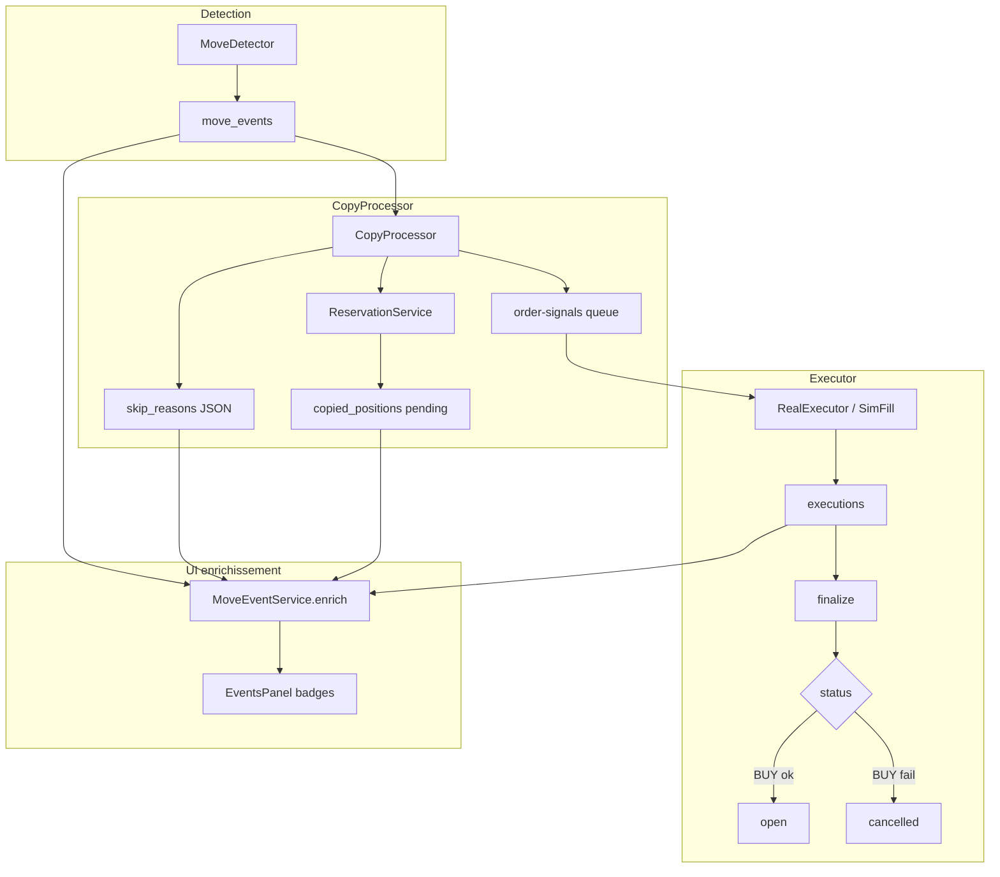

# Rapport d'audit — Refactors copy outcomes, EntryPipeline et RiskConfig JSON

**Date** : 2026-06-17  
**Version** : Polywatch v0.7  
**Objet** : documenter les dysfonctionnements observés en trading live, les correctifs déjà appliqués, et le plan de refactor structuré en trois chantiers (outcomes unifiés, pipeline d'entrée, config sim/real JSON).  
**Statut global** : **Planifié** — refactors 1, 2 et 3 non implémentés au moment de cet audit ; correctifs ponctuels partiellement déployés (voir §4).

---

## 1. Contexte et symptômes utilisateur

### 1.1 Symptômes rapportés

- Dashboard live : **0 position ouverte** malgré des événements « Ouverture » marqués **Traité**.
- Badge **Live** affiché sans tooltip d'erreur explicite.
- Paramètre **montant fixe ~1,50 pUSD** configuré, mais ordres réels observés à **~0,30 pUSD**.

### 1.2 Données BDD (PostgreSQL locale, 2026-06-17)

| Élément | Valeur |
|---|---|
| `real_trading_enabled` | `true` |
| Solde pUSD wallet dépôt (on-chain) | **~3,69 pUSD** |
| Mode sizing live | `fixed_usdc` |
| Montant fixe live | **1,50 pUSD** |
| Positions live ouvertes | **0** |
| Positions live annulées (`cancelled`) | **34** |
| Positions live clôturées (historique OK) | **13** |

Dernières tentatives d'entrée live (ex. Bonereaper, RN1) :

| Montant ordre | Erreur CLOB | Statut position |
|---|---|---|
| ~0,30 pUSD | `order_not_matched` | `cancelled` |
| ~0,50 pUSD | `order_not_matched` | `cancelled` |

**Conclusion opérationnelle** : le pipeline **tente bien** de copier en live ; l'échec survient à l'**exécution CLOB**, pas au stade copy-processor (sauf skips explicites).

---

## 2. Analyse des causes racines

### 2.1 Cause A — Résultat copy fragmenté (UX / modèle)

Le résultat d'une tentative de copy est réparti entre plusieurs sources sans modèle unifié :

| Phase | Source | Exemple |
|---|---|---|
| Refus copy | `move_events.skip_reasons` | `"Quantité estimée nulle"` |
| Ordre envoyé | `copied_positions` (pending) | position créée puis annulée |
| Échec CLOB | `executions.error` | `order_not_matched` |
| Statut final position | `copied_positions.status` | `cancelled` (pas `failed`) |

Conséquences :

- L'UI déduisait `executedReal = true` dès qu'une **position pending** existait → badge Live « succès » sans remplissage réel.
- Le statut **Traité** signifie « copy-processor terminé », pas « position ouverte ».
- Les échecs d'entrée live vont en **`cancelled`**, absents des onglets **Ouvertes** et **Échouées**.
- Le filtre événements **Live** (`applyModeFilter`) exige `EXISTS copied_positions` → les skips purement copy-processor peuvent être invisibles.

**Fichiers concernés** :

- [`packages/core/src/services/move-event.service.ts`](packages/core/src/services/move-event.service.ts) — enrichissement `loadCopyStats`
- [`packages/core/src/entities/MoveEvent.ts`](packages/core/src/entities/MoveEvent.ts) — `skip_reasons`
- [`packages/core/src/services/execution.service.ts`](packages/core/src/services/execution.service.ts) — `finalize` → `cancelled` sur BUY failed
- [`packages/frontend/src/components/EventsPanel.tsx`](packages/frontend/src/components/EventsPanel.tsx)

### 2.2 Cause B — Montant fixe × score de signal

Le sizing **n'était pas proportionnel au trader** en live (`real_sizing_mode = fixed_usdc`).

En revanche, **tous les modes** appliquent un multiplicateur de score de signal :

```typescript
// packages/core/src/sizing/compute.ts
targetSpendUsdc = applySignalMultiplier(targetSpendUsdc, input.signalMultiplier);
// multiplier ∈ [0.1, 1.0] ; skip si < 0.2
```

Cas observé : `1,50 × 0,2 = 0,30 pUSD` → ordre trop petit pour un FAK fiable sur Polymarket.

**Fichiers concernés** :

- [`packages/core/src/sizing/signal-scorer.ts`](packages/core/src/sizing/signal-scorer.ts)
- [`packages/worker/src/processors/copy-processor.ts`](packages/worker/src/processors/copy-processor.ts) — gate score &lt; 0,2
- [`packages/core/src/sizing/compute.ts`](packages/core/src/sizing/compute.ts)

### 2.3 Cause C — Prix d'achat live (WS stale)

`RealExecutor` utilisait `getExecutablePrices` (carnet WS en mémoire) pour les **BUY**, alors que le copy-processor valide le VWAP via **REST** (`fetchExecutablePrices`). Risque de limite FAK sous l'ask courant → `order_not_matched`.

**Fichier concerné** : [`packages/worker/src/clob/real-executor.ts`](packages/worker/src/clob/real-executor.ts)

### 2.4 Cause D — Config sim/real dupliquée (maintenance)

`RiskConfig` expose ~40 champs préfixés `sim_*` / `real_*` + champs legacy globaux. La policy compense via `pickModeValue`, mais :

- l'API `/risk-config` et l'UI [`env-settings-types.ts`](packages/frontend/src/components/env-settings-types.ts) dupliquent les listes `SIM_FIELDS` / `REAL_FIELDS` ;
- chaque nouveau paramètre (ex. `signalScoreSizingEnabled`) doit être ajouté à 6+ endroits.

---

## 3. Cartographie du flux actuel (avant refactors)



Le point de rupture UX : **ENR** reconstruit la vérité utilisateur à partir de 3 tables sans contrat unique.

---

## 4. Correctifs déjà appliqués (hors refactors planifiés)

| Correctif | Fichier(s) | Effet |
|---|---|---|
| BUY live via REST (`fetchExecutablePrices`) | `real-executor.ts` | Limite FAK alignée sur le carnet frais |
| Seuil min live 1 USDC avant envoi CLOB | `copy-processor.ts`, `constants.ts` | Skip explicite si notional &lt; 1 $ |
| `executedReal` = fill réel (pas simple existence position) | `move-event.service.ts` | Badge Live moins trompeur |
| Tooltips erreurs exécution + statut Ignoré/Copié | `EventsPanel.tsx` | Meilleure lisibilité |
| Toggle **Adapter la mise au score du signal** | `RiskConfig`, UI, `entry-sizing.ts`, `copy-processor.ts` | Montant fixe brut si désactivé |
| Refresh EventsPanel sur socket `execution` | `EventsPanel.tsx` | Mise à jour post-CLOB |

Ces correctifs **atténuent** les symptômes mais **ne remplacent pas** les refactors structurels ci-dessous.

---

## 5. Plan de refactor — vue d'ensemble

| ID | Intitulé | Priorité | Effort estimé | PR suggérée |
|---|---|---|---|---|
| **R1** | Modèle unifié `CopyModeOutcome` + persistance | Haute | 1–2 j | PR-1 |
| **R2** | Extraction `EntryPipeline` | Moyenne | 1 j | PR-2 |
| **R3** | RiskConfig JSON `sim_settings` / `real_settings` | Basse (volume) | 2–3 j | PR-3 (+ PR-4 cleanup colonnes) |

**Ordre imposé** : R1 → R2 → R3 (R2 indépendant du schéma config tant que `getMode*` reste stable).

---

## 6. Refactor 1 — Outcomes copy unifiés (R1)

### 6.1 Objectif

Une seule structure par mode (`sim` / `real`) décrivant le parcours : ignoré → dispatché → rempli / échoué.

### 6.2 Modèle cible

Nouveau module : `packages/core/src/move-events/copy-outcome.ts`

```typescript
type CopyOutcomeStatus =
  | 'pending'
  | 'skipped'
  | 'dispatched'
  | 'filled'
  | 'failed';

interface CopyModeOutcome {
  status: CopyOutcomeStatus;
  phase: 'copy' | 'execution' | null;
  reasonCode: string | null;
  reasonLabel: string | null;
}
```

Fonction pure : `resolveCopyModeOutcome(mode, { skipReason, position, buyExecution })`.

### 6.3 Persistance

Colonne JSON `move_events.copy_outcomes` :

```json
{
  "sim": { "status": "skipped", "phase": "copy", "reasonLabel": "Échec de la réservation" },
  "real": { "status": "failed", "phase": "execution", "reasonCode": "order_not_matched" }
}
```

**Écriture** :

- `CopyProcessor` → `skipped` ou `dispatched`
- `ExecutionService.finalize` (BUY entry) → `filled` ou `failed`
- `MoveEventService.updateCopyOutcomes` + notification socket

**Lecture** :

- API move-events expose `outcomeSim` / `outcomeReal`
- Déprécier `executedSim`, `skipReasonsSim`, `executionErrorSim` (alias 1 release)

### 6.4 UI

- Refactor [`EventsPanel.tsx`](packages/frontend/src/components/EventsPanel.tsx)
- Nouveau [`packages/frontend/src/lib/copy-outcome.ts`](packages/frontend/src/lib/copy-outcome.ts)
- Corriger filtre Live : inclure `copy_outcomes.real` même sans position

### 6.5 Tests

- `copy-outcome.test.ts` — matrice de cas
- Test enrichissement API move-events

### 6.6 Critère de done R1

- Plus de badge Live vert sur `order_not_matched`
- Tooltip unique par mode avec raison FR
- Filtre Live inclut skips copy et échecs CLOB

---

## 7. Refactor 2 — EntryPipeline (R2)

### 7.1 Objectif

Extraire ~255 lignes de `handleEntry` vers un module testable.

### 7.2 Module cible

`packages/worker/src/copy/entry-pipeline.ts`

Étapes :

1. `resolveBalancesAndPortfolio`
2. `guardMarketTiming`
3. `fetchRoughLiquidity` (pass 1 VWAP)
4. `evaluateSignalScore`
5. `computeTargetQuantity` (pass 2 + 3)
6. `guardMinNotionalReal` / `guardBidAskRatio`
7. `reserveAndEnqueue`

`CopyProcessor.handleEntry` → wrapper ~15 lignes.

### 7.3 Tests

`packages/worker/src/copy/entry-pipeline.test.ts` — mocks `connectionManager`, sans DB.

Cas obligatoires :

- Montant fixe, signal score désactivé → montant plein
- Liquidité insuffisante
- Ratio bid/ask insuffisant
- Échec reservation (`max_exposure`, etc.)

### 7.4 Non-objectifs

- Pas de changement sémantique des skips (déjà R1 pour l'affichage)
- Rester dans `packages/worker` (dépendance `PolymarketConnectionManager`)

### 7.5 Critère de done R2

- `copy-processor.ts` &lt; 400 lignes
- Tests entry-pipeline verts

---

## 8. Refactor 3 — RiskConfig JSON sim/real (R3)

**Décision produit** : migration DB complète (abstraction + colonnes JSON), pas seulement refactor TypeScript.

### 8.1 Schéma cible

**Conservé à la racine** :

- `realTradingEnabled`
- `maxSlippagePercent`, `exitSlippageGuardPercent`
- `simInitialCapital`

**Nouveau JSON** :

- `sim_settings` → `ModeRiskSettings`
- `real_settings` → `ModeRiskSettings`

**Supprimé après migration** : tous les champs flat `sim_*` / `real_*` et legacy (`maxExposureUsdc`, `killSwitchAction`, etc.).

Interface : `packages/core/src/risk/mode-settings.ts`

### 8.2 Migration

Script idempotent au boot ([`seed/defaults.ts`](packages/core/src/seed/defaults.ts)) :

1. Si JSON NULL → construire depuis colonnes flat ([`risk-config-backfill.ts`](packages/core/src/seed/risk-config-backfill.ts))
2. Persister JSON
3. PR cleanup : `ALTER TABLE` drop colonnes obsolètes

### 8.3 API breaking change

**GET/PUT `/risk-config`** nested :

```json
{
  "realTradingEnabled": true,
  "simInitialCapital": 10000,
  "maxSlippagePercent": 2,
  "sim": { "sizingMode": "fixed_usdc", "entryUsdcAmount": 1.5, "...": "..." },
  "real": { "...": "..." }
}
```

Fichiers :

- [`packages/backend/src/routes/config.ts`](packages/backend/src/routes/config.ts) — Zod nested
- [`packages/core/src/risk/risk-config-api.ts`](packages/core/src/risk/risk-config-api.ts)
- [`packages/core/src/risk/policy.ts`](packages/core/src/risk/policy.ts) — `getModeSettings()` ; `getMode*` inchangés en signature

### 8.4 Frontend

- [`env-settings-types.ts`](packages/frontend/src/components/env-settings-types.ts) — structure `{ sim, real }`
- [`EnvSettingsDialog.tsx`](packages/frontend/src/components/EnvSettingsDialog.tsx)
- [`settings-sections.tsx`](packages/frontend/src/components/settings-sections.tsx) — fin de `modeSettingKey` × N

### 8.5 Critère de done R3

- Entity sans champs `sim_*`/`real_*` flat
- Round-trip migration testé
- UI Configurer sim/live fonctionnelle
- Tests `policy.test.ts` verts

---

## 9. Risques et mitigations

| Risque | Sévérité | Mitigation |
|---|---|---|
| Régression ordre live | Haute | R1 puis R2 ; test manuel 1 entrée live par PR |
| Perte valeurs config à la migration | Haute | Script idempotent + test flat→JSON→getMode* |
| API breaking sans déploiement coordonné | Haute | PR unique backend+frontend pour R3 |
| Outcome async dispatched→failed | Moyenne | Persister `copy_outcomes` à finalize ; socket `execution` |
| Scope creep R3 | Moyenne | Scinder PR-3 (migration) et PR-4 (drop colonnes) |

---

## 10. Checklist de validation post-refactor

### Trading live

- [ ] Événement OPENED live skip copy → badge rouge + tooltip FR
- [ ] Événement OPENED live `order_not_matched` → statut **Échoué** explicite, pas **Traité** ambigu
- [ ] Montant fixe 1,50 $ + score signal **off** → ordre ≥ 1,50 $ (plafonné max position / solde)
- [ ] Position remplie visible dans **Ouvertes**

### Technique

- [ ] `npm run build` OK
- [ ] Tests `copy-outcome`, `entry-pipeline`, `policy`, `risk-config-backfill`
- [ ] Docs [`docs/code/02-pipeline-copy-trading.md`](docs/code/02-pipeline-copy-trading.md) à jour

---

## 11. Fichiers impactés (synthèse)

| Refactor | Fichiers principaux |
|---|---|
| R1 | `copy-outcome.ts`, `MoveEvent.ts`, `move-event.service.ts`, `copy-processor.ts`, `execution-completion.ts`, `EventsPanel.tsx`, `copy-outcome.ts` (frontend) |
| R2 | `entry-pipeline.ts`, `entry-pipeline.test.ts`, `copy-processor.ts` |
| R3 | `RiskConfig.ts`, `mode-settings.ts`, `policy.ts`, `risk-config-api.ts`, `config.ts`, `seed/defaults.ts`, `env-settings-types.ts`, `EnvSettingsDialog.tsx`, `settings-sections.tsx` |

---

## 12. Références

- Plan détaillé Cursor : `.cursor/plans/refactors_copy_outcomes_865dc65b.plan.md`
- Pipeline copy : [`docs/code/02-pipeline-copy-trading.md`](docs/code/02-pipeline-copy-trading.md)
- Issues ouvertes historiques : [`open-issues.md`](open-issues.md)

---

## 13. Historique

| Date | Action |
|---|---|
| 2026-06-17 | Audit rédigé — symptômes live, causes A–D, correctifs ponctuels, plan R1/R2/R3 |
| — | R1 implémenté | *à compléter* |
| — | R2 implémenté | *à compléter* |
| — | R3 implémenté | *à compléter* |
